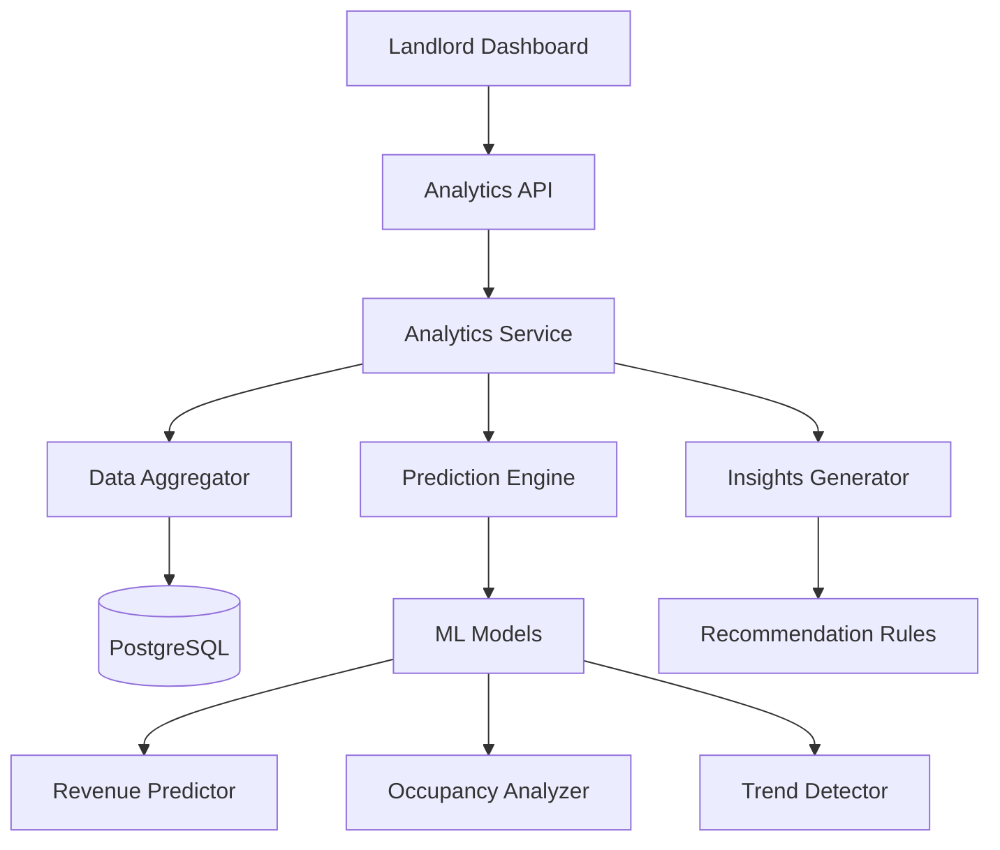
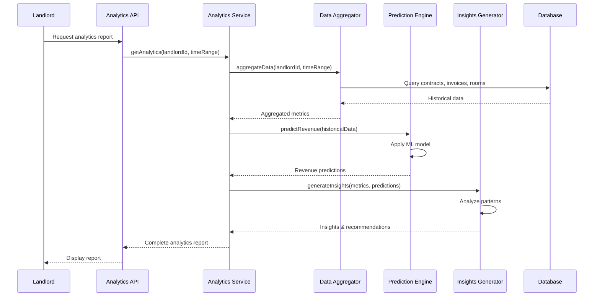

# Design Document: AI Phân Tích và Dự Đoán

## Overview

Tính năng AI phân tích và dự đoán cung cấp khả năng phân tích dữ liệu thuê phòng, dự đoán doanh thu tương lai, phát hiện xu hướng theo mùa và đưa ra insights/recommendations cho chủ nhà. Hệ thống sử dụng machine learning models để xử lý dữ liệu lịch sử từ contracts, invoices, rooms và tạo ra các báo cáo phân tích có giá trị.

Hệ thống được thiết kế với kiến trúc modular, tách biệt giữa data collection, analysis engine, prediction models và presentation layer. Điều này cho phép dễ dàng mở rộng và thay đổi các thuật toán phân tích mà không ảnh hưởng đến các thành phần khác.

## Architecture



## Main Algorithm/Workflow



## Components and Interfaces

### Component 1: Analytics API

**Purpose**: REST API endpoints để landlord truy cập analytics data

**Interface**:
```typescript
interface AnalyticsAPI {
  getOverview(landlordId: string, timeRange: TimeRange): Promise<AnalyticsOverview>
  getRevenuePrediction(landlordId: string, months: number): Promise<RevenuePrediction>
  getOccupancyAnalysis(landlordId: string, timeRange: TimeRange): Promise<OccupancyAnalysis>
  getTrendAnalysis(landlordId: string): Promise<TrendAnalysis>
  getRecommendations(landlordId: string): Promise<Recommendation[]>
}
```

**Responsibilities**:
- Xác thực và authorize landlord requests
- Validate input parameters
- Gọi Analytics Service để lấy data
- Format và return response
- Handle errors và rate limiting

### Component 2: Analytics Service

**Purpose**: Core business logic cho analytics và predictions

**Interface**:
```typescript
interface AnalyticsService {
  calculateOccupancyRate(landlordId: string, timeRange: TimeRange): Promise<OccupancyMetrics>
  calculateRevenueMetrics(landlordId: string, timeRange: TimeRange): Promise<RevenueMetrics>
  predictFutureRevenue(landlordId: string, months: number): Promise<PredictionResult>
  detectSeasonalPatterns(landlordId: string): Promise<SeasonalPattern[]>
  generateInsights(landlordId: string): Promise<Insight[]>
}
```

**Responsibilities**:
- Orchestrate data aggregation
- Coordinate prediction models
- Generate insights và recommendations
- Cache results để improve performance
- Log analytics events

### Component 3: Data Aggregator

**Purpose**: Thu thập và tổng hợp dữ liệu từ database

**Interface**:
```typescript
interface DataAggregator {
  getContractHistory(landlordId: string, timeRange: TimeRange): Promise<ContractData[]>
  getInvoiceHistory(landlordId: string, timeRange: TimeRange): Promise<InvoiceData[]>
  getRoomStatistics(landlordId: string): Promise<RoomStats[]>
  aggregateMonthlyRevenue(landlordId: string, months: number): Promise<MonthlyRevenue[]>
  calculateOccupancyByPeriod(landlordId: string, timeRange: TimeRange): Promise<OccupancyData[]>
}
```

**Responsibilities**:
- Query database efficiently với proper indexes
- Transform raw data thành structured format
- Calculate basic metrics (totals, averages, counts)
- Handle missing data và outliers
- Optimize queries để avoid N+1 problems

### Component 4: Prediction Engine

**Purpose**: Machine learning models để dự đoán revenue và trends

**Interface**:
```typescript
interface PredictionEngine {
  predictRevenue(historicalData: MonthlyRevenue[], months: number): Promise<PredictionResult>
  predictOccupancy(historicalData: OccupancyData[], months: number): Promise<OccupancyPrediction>
  detectAnomalies(data: TimeSeriesData[]): Promise<Anomaly[]>
  calculateConfidenceInterval(prediction: number, historicalData: number[]): ConfidenceInterval
}
```

**Responsibilities**:
- Implement time series forecasting (linear regression, moving average)
- Calculate prediction confidence intervals
- Detect anomalies trong data
- Handle seasonal adjustments
- Validate prediction results

### Component 5: Insights Generator

**Purpose**: Phân tích patterns và tạo recommendations

**Interface**:
```typescript
interface InsightsGenerator {
  analyzeRevenueGrowth(data: MonthlyRevenue[]): Promise<GrowthInsight>
  identifyPeakPeriods(data: OccupancyData[]): Promise<PeakPeriod[]>
  compareWithBenchmarks(metrics: Metrics): Promise<BenchmarkComparison>
  generateRecommendations(analysis: AnalysisResult): Promise<Recommendation[]>
}
```

**Responsibilities**:
- Identify trends và patterns
- Compare với industry benchmarks
- Generate actionable recommendations
- Prioritize insights by impact
- Format insights cho human readability

## Data Models

### Model 1: AnalyticsOverview

```typescript
interface AnalyticsOverview {
  landlordId: string
  timeRange: TimeRange
  occupancyRate: number
  totalRevenue: number
  averageRoomPrice: number
  totalRooms: number
  occupiedRooms: number
  revenueGrowth: number
  occupancyTrend: 'increasing' | 'decreasing' | 'stable'
  generatedAt: Date
}
```

**Validation Rules**:
- occupancyRate phải từ 0 đến 100
- totalRevenue >= 0
- averageRoomPrice >= 0
- totalRooms > 0
- occupiedRooms <= totalRooms
- revenueGrowth có thể âm (decline) hoặc dương (growth)

### Model 2: RevenuePrediction

```typescript
interface RevenuePrediction {
  landlordId: string
  predictions: MonthlyPrediction[]
  totalPredicted: number
  confidenceLevel: number
  methodology: 'linear_regression' | 'moving_average' | 'exponential_smoothing'
  generatedAt: Date
}

interface MonthlyPrediction {
  month: number
  year: number
  predictedRevenue: number
  lowerBound: number
  upperBound: number
  confidence: number
}
```

**Validation Rules**:
- predictions array không empty
- predictedRevenue >= 0
- lowerBound <= predictedRevenue <= upperBound
- confidence từ 0 đến 1
- confidenceLevel từ 0 đến 100
- month từ 1 đến 12
- year >= current year

### Model 3: OccupancyAnalysis

```typescript
interface OccupancyAnalysis {
  landlordId: string
  timeRange: TimeRange
  currentOccupancyRate: number
  historicalData: OccupancyDataPoint[]
  averageOccupancy: number
  peakOccupancyPeriod: PeakPeriod
  lowOccupancyPeriod: PeakPeriod
  trend: TrendData
}

interface OccupancyDataPoint {
  date: Date
  occupancyRate: number
  occupiedRooms: number
  totalRooms: number
}

interface PeakPeriod {
  startDate: Date
  endDate: Date
  averageRate: number
  description: string
}
```

**Validation Rules**:
- occupancyRate từ 0 đến 100
- historicalData phải có ít nhất 3 data points
- occupiedRooms <= totalRooms
- peakOccupancyPeriod.averageRate >= lowOccupancyPeriod.averageRate

### Model 4: TrendAnalysis

```typescript
interface TrendAnalysis {
  landlordId: string
  seasonalPatterns: SeasonalPattern[]
  revenueGrowthRate: number
  occupancyTrend: TrendDirection
  insights: Insight[]
  generatedAt: Date
}

interface SeasonalPattern {
  season: 'spring' | 'summer' | 'fall' | 'winter'
  months: number[]
  averageOccupancy: number
  averageRevenue: number
  description: string
}

interface Insight {
  id: string
  type: 'positive' | 'negative' | 'neutral' | 'warning'
  title: string
  description: string
  impact: 'high' | 'medium' | 'low'
  actionable: boolean
}

type TrendDirection = 'increasing' | 'decreasing' | 'stable' | 'volatile'
```

**Validation Rules**:
- seasonalPatterns phải có 4 seasons
- revenueGrowthRate có thể âm hoặc dương
- insights array có thể empty nếu không có insights
- impact phải là một trong các giá trị: high, medium, low

### Model 5: Recommendation

```typescript
interface Recommendation {
  id: string
  landlordId: string
  type: 'pricing' | 'marketing' | 'maintenance' | 'occupancy' | 'revenue'
  priority: 'high' | 'medium' | 'low'
  title: string
  description: string
  expectedImpact: string
  actionItems: ActionItem[]
  basedOn: string[]
  createdAt: Date
}

interface ActionItem {
  id: string
  description: string
  completed: boolean
  dueDate?: Date
}
```

**Validation Rules**:
- type phải là một trong các giá trị định nghĩa
- priority phải là high, medium, hoặc low
- title và description không empty
- actionItems có thể empty
- basedOn array chứa các data points/insights đã dùng để tạo recommendation

## Algorithmic Pseudocode

### Main Processing Algorithm

```pascal
ALGORITHM processAnalyticsRequest(landlordId, timeRange)
INPUT: landlordId of type String, timeRange of type TimeRange
OUTPUT: analyticsReport of type AnalyticsOverview

BEGIN
  ASSERT landlordId IS NOT NULL AND landlordId IS NOT EMPTY
  ASSERT timeRange.startDate <= timeRange.endDate
  
  // Step 1: Aggregate historical data
  contractData ← dataAggregator.getContractHistory(landlordId, timeRange)
  invoiceData ← dataAggregator.getInvoiceHistory(landlordId, timeRange)
  roomStats ← dataAggregator.getRoomStatistics(landlordId)
  
  ASSERT contractData IS NOT NULL
  ASSERT invoiceData IS NOT NULL
  ASSERT roomStats IS NOT NULL
  
  // Step 2: Calculate metrics
  occupancyRate ← calculateOccupancyRate(roomStats, contractData)
  totalRevenue ← calculateTotalRevenue(invoiceData)
  averagePrice ← calculateAveragePrice(roomStats)
  
  // Step 3: Analyze trends
  revenueGrowth ← calculateGrowthRate(invoiceData)
  occupancyTrend ← determineTrend(contractData)
  
  // Step 4: Build report
  report ← CREATE AnalyticsOverview WITH
    landlordId: landlordId
    timeRange: timeRange
    occupancyRate: occupancyRate
    totalRevenue: totalRevenue
    averageRoomPrice: averagePrice
    revenueGrowth: revenueGrowth
    occupancyTrend: occupancyTrend
    generatedAt: NOW()
  END CREATE
  
  ASSERT report.occupancyRate >= 0 AND report.occupancyRate <= 100
  ASSERT report.totalRevenue >= 0
  
  RETURN report
END
```

**Preconditions**:
- landlordId phải tồn tại trong database
- timeRange.startDate <= timeRange.endDate
- Landlord phải có ít nhất một building

**Postconditions**:
- Return valid AnalyticsOverview object
- occupancyRate trong khoảng [0, 100]
- totalRevenue >= 0
- Không có side effects trên database

**Loop Invariants**: N/A (không có loops trong algorithm chính)

### Revenue Prediction Algorithm

```pascal
ALGORITHM predictFutureRevenue(historicalData, months)
INPUT: historicalData of type MonthlyRevenue[], months of type Integer
OUTPUT: prediction of type RevenuePrediction

BEGIN
  ASSERT historicalData.length >= 3
  ASSERT months > 0 AND months <= 24
  
  // Step 1: Prepare data
  sortedData ← SORT historicalData BY date ASCENDING
  
  // Step 2: Calculate linear regression
  n ← sortedData.length
  sumX ← 0
  sumY ← 0
  sumXY ← 0
  sumX2 ← 0
  
  FOR i FROM 0 TO n-1 DO
    ASSERT sortedData[i].revenue >= 0
    
    x ← i
    y ← sortedData[i].revenue
    sumX ← sumX + x
    sumY ← sumY + y
    sumXY ← sumXY + (x * y)
    sumX2 ← sumX2 + (x * x)
  END FOR
  
  // Calculate slope and intercept
  slope ← (n * sumXY - sumX * sumY) / (n * sumX2 - sumX * sumX)
  intercept ← (sumY - slope * sumX) / n
  
  // Step 3: Generate predictions
  predictions ← EMPTY ARRAY
  
  FOR month FROM 1 TO months DO
    x ← n + month - 1
    predictedValue ← slope * x + intercept
    
    // Calculate confidence interval
    standardError ← calculateStandardError(sortedData, slope, intercept)
    margin ← 1.96 * standardError
    
    prediction ← CREATE MonthlyPrediction WITH
      predictedRevenue: MAX(0, predictedValue)
      lowerBound: MAX(0, predictedValue - margin)
      upperBound: predictedValue + margin
      confidence: calculateConfidence(standardError)
    END CREATE
    
    predictions.ADD(prediction)
  END FOR
  
  // Step 4: Build result
  result ← CREATE RevenuePrediction WITH
    predictions: predictions
    totalPredicted: SUM(predictions.predictedRevenue)
    methodology: "linear_regression"
    generatedAt: NOW()
  END CREATE
  
  ASSERT result.predictions.length = months
  ASSERT result.totalPredicted >= 0
  
  RETURN result
END
```

**Preconditions**:
- historicalData phải có ít nhất 3 data points
- months phải từ 1 đến 24
- Tất cả revenue values phải >= 0

**Postconditions**:
- Return valid RevenuePrediction object
- predictions array có đúng số lượng months
- Mỗi prediction có lowerBound <= predictedRevenue <= upperBound
- totalPredicted >= 0

**Loop Invariants**:
- Loop 1: sumX, sumY, sumXY, sumX2 được tính đúng cho tất cả items đã process
- Loop 2: Tất cả predictions đã tạo đều valid và có confidence interval

### Seasonal Pattern Detection Algorithm

```pascal
ALGORITHM detectSeasonalPatterns(occupancyData)
INPUT: occupancyData of type OccupancyDataPoint[]
OUTPUT: patterns of type SeasonalPattern[]

BEGIN
  ASSERT occupancyData.length >= 12
  
  // Group data by season
  spring ← FILTER occupancyData WHERE month IN [3, 4, 5]
  summer ← FILTER occupancyData WHERE month IN [6, 7, 8]
  fall ← FILTER occupancyData WHERE month IN [9, 10, 11]
  winter ← FILTER occupancyData WHERE month IN [12, 1, 2]
  
  patterns ← EMPTY ARRAY
  
  FOR EACH season IN [spring, summer, fall, winter] DO
    IF season.length > 0 THEN
      avgOccupancy ← AVERAGE(season.occupancyRate)
      avgRevenue ← AVERAGE(season.revenue)
      
      pattern ← CREATE SeasonalPattern WITH
        averageOccupancy: avgOccupancy
        averageRevenue: avgRevenue
      END CREATE
      
      patterns.ADD(pattern)
    END IF
  END FOR
  
  ASSERT patterns.length <= 4
  
  RETURN patterns
END
```

**Preconditions**:
- occupancyData phải có ít nhất 12 months data
- Mỗi data point phải có valid month (1-12)

**Postconditions**:
- Return array có tối đa 4 seasonal patterns
- Mỗi pattern có averageOccupancy và averageRevenue >= 0

**Loop Invariants**:
- Tất cả patterns đã tạo đều có valid averages

### Insights Generation Algorithm

```pascal
ALGORITHM generateInsights(metrics, predictions, trends)
INPUT: metrics of type AnalyticsOverview, predictions of type RevenuePrediction, trends of type TrendAnalysis
OUTPUT: insights of type Insight[]

BEGIN
  insights ← EMPTY ARRAY
  
  // Insight 1: Occupancy rate analysis
  IF metrics.occupancyRate < 70 THEN
    insight ← CREATE Insight WITH
      type: "warning"
      title: "Low Occupancy Rate"
      description: "Occupancy rate is below 70%. Consider marketing campaigns."
      impact: "high"
      actionable: true
    END CREATE
    insights.ADD(insight)
  ELSE IF metrics.occupancyRate > 90 THEN
    insight ← CREATE Insight WITH
      type: "positive"
      title: "High Occupancy Rate"
      description: "Excellent occupancy rate above 90%."
      impact: "high"
      actionable: false
    END CREATE
    insights.ADD(insight)
  END IF
  
  // Insight 2: Revenue growth analysis
  IF metrics.revenueGrowth < -5 THEN
    insight ← CREATE Insight WITH
      type: "negative"
      title: "Revenue Decline"
      description: "Revenue decreased by more than 5%. Review pricing strategy."
      impact: "high"
      actionable: true
    END CREATE
    insights.ADD(insight)
  ELSE IF metrics.revenueGrowth > 10 THEN
    insight ← CREATE Insight WITH
      type: "positive"
      title: "Strong Revenue Growth"
      description: "Revenue increased by more than 10%."
      impact: "medium"
      actionable: false
    END CREATE
    insights.ADD(insight)
  END IF
  
  // Insight 3: Prediction confidence
  IF predictions.confidenceLevel < 60 THEN
    insight ← CREATE Insight WITH
      type: "warning"
      title: "Low Prediction Confidence"
      description: "Predictions have low confidence. More data needed."
      impact: "low"
      actionable: false
    END CREATE
    insights.ADD(insight)
  END IF
  
  RETURN insights
END
```

**Preconditions**:
- metrics, predictions, trends phải là valid objects
- metrics.occupancyRate trong [0, 100]

**Postconditions**:
- Return array of insights (có thể empty)
- Mỗi insight có valid type, impact, và actionable flag

**Loop Invariants**: N/A (không có explicit loops)

## Key Functions with Formal Specifications

### Function 1: calculateOccupancyRate()

```typescript
function calculateOccupancyRate(
  roomStats: RoomStats[], 
  contractData: ContractData[]
): number
```

**Preconditions:**
- roomStats array không empty
- Mỗi RoomStats có valid totalRooms > 0
- contractData có thể empty (occupancy = 0)

**Postconditions:**
- Return value trong khoảng [0, 100]
- Nếu không có rooms, return 0
- Nếu tất cả rooms occupied, return 100
- Không có side effects

**Loop Invariants:** 
- Khi iterate qua rooms: tổng occupied rooms <= tổng total rooms

### Function 2: predictRevenue()

```typescript
function predictRevenue(
  historicalData: MonthlyRevenue[], 
  months: number
): Promise<RevenuePrediction>
```

**Preconditions:**
- historicalData.length >= 3
- months trong khoảng [1, 24]
- Tất cả revenue values >= 0

**Postconditions:**
- Return RevenuePrediction với predictions.length === months
- Mỗi prediction có lowerBound <= predictedRevenue <= upperBound
- totalPredicted >= 0
- confidenceLevel trong [0, 100]

**Loop Invariants:**
- Khi tạo predictions: tất cả predictions đã tạo đều valid

### Function 3: detectSeasonalPatterns()

```typescript
function detectSeasonalPatterns(
  occupancyData: OccupancyDataPoint[]
): Promise<SeasonalPattern[]>
```

**Preconditions:**
- occupancyData.length >= 12 (ít nhất 1 năm data)
- Mỗi data point có valid month [1-12]
- occupancyRate trong [0, 100]

**Postconditions:**
- Return array có tối đa 4 patterns (4 seasons)
- Mỗi pattern có averageOccupancy >= 0
- Mỗi pattern có averageRevenue >= 0
- Patterns được sort theo season order

**Loop Invariants:**
- Khi group data by season: không có data point bị duplicate
- Khi calculate averages: tất cả values đều valid

### Function 4: generateRecommendations()

```typescript
function generateRecommendations(
  analysis: AnalysisResult
): Promise<Recommendation[]>
```

**Preconditions:**
- analysis object phải complete và valid
- analysis.metrics không null
- analysis.predictions không null

**Postconditions:**
- Return array of recommendations (có thể empty)
- Mỗi recommendation có valid priority
- Recommendations được sort by priority (high → low)
- Mỗi recommendation có ít nhất 1 actionItem

**Loop Invariants:**
- Khi tạo recommendations: không có duplicate recommendations

## Example Usage

```typescript
// Example 1: Get analytics overview
const analytics = await analyticsService.getOverview(
  landlordId, 
  { startDate: new Date('2024-01-01'), endDate: new Date('2024-12-31') }
)

console.log(`Occupancy Rate: ${analytics.occupancyRate}%`)
console.log(`Total Revenue: ${analytics.totalRevenue}`)
console.log(`Revenue Growth: ${analytics.revenueGrowth}%`)

// Example 2: Get revenue predictions
const predictions = await analyticsService.predictFutureRevenue(landlordId, 6)

predictions.predictions.forEach(pred => {
  console.log(`${pred.month}/${pred.year}: ${pred.predictedRevenue}`)
  console.log(`  Confidence: ${pred.confidence * 100}%`)
  console.log(`  Range: [${pred.lowerBound}, ${pred.upperBound}]`)
})

// Example 3: Get seasonal patterns
const trends = await analyticsService.detectSeasonalPatterns(landlordId)

trends.seasonalPatterns.forEach(pattern => {
  console.log(`${pattern.season}: ${pattern.averageOccupancy}% occupancy`)
})

// Example 4: Get recommendations
const recommendations = await analyticsService.generateRecommendations(landlordId)

recommendations.forEach(rec => {
  console.log(`[${rec.priority}] ${rec.title}`)
  console.log(`  ${rec.description}`)
  console.log(`  Expected Impact: ${rec.expectedImpact}`)
})

// Example 5: Complete workflow
async function analyzeProperty(landlordId: string) {
  // Validate landlord exists
  const landlord = await prisma.landlord.findUnique({ where: { id: landlordId } })
  if (!landlord) throw new Error('Landlord not found')
  
  // Get analytics
  const timeRange = { 
    startDate: new Date(Date.now() - 365 * 24 * 60 * 60 * 1000), 
    endDate: new Date() 
  }
  const analytics = await analyticsService.getOverview(landlordId, timeRange)
  
  // Get predictions
  const predictions = await analyticsService.predictFutureRevenue(landlordId, 12)
  
  // Get trends
  const trends = await analyticsService.detectSeasonalPatterns(landlordId)
  
  // Generate insights
  const insights = await insightsGenerator.generateInsights(analytics, predictions, trends)
  
  // Generate recommendations
  const recommendations = await insightsGenerator.generateRecommendations({
    metrics: analytics,
    predictions,
    trends
  })
  
  return {
    analytics,
    predictions,
    trends,
    insights,
    recommendations
  }
}
```

## Correctness Properties

*A property is a characteristic or behavior that should hold true across all valid executions of a system-essentially, a formal statement about what the system should do. Properties serve as the bridge between human-readable specifications and machine-verifiable correctness guarantees.*

### Property 1: Occupancy Rate Bounds

*For any* landlord and time range, when calculating occupancy rate, the result should be between 0 and 100 percent inclusive.

**Validates: Requirements 1.2, 3.2**

### Property 2: Revenue Non-Negativity

*For any* analytics calculation involving revenue (total revenue, predicted revenue, seasonal revenue), all revenue values should be non-negative.

**Validates: Requirements 1.3, 2.4, 4.3**

### Property 3: Analytics Overview Completeness

*For any* landlord requesting analytics overview, the returned object should contain all required fields: occupancy rate, total revenue, average room price, revenue growth, occupancy trend, and generated timestamp.

**Validates: Requirements 1.1, 1.6**

### Property 4: Time Range Filtering

*For any* time range specified, all returned data (contracts, invoices, occupancy data) should fall within that time range.

**Validates: Requirements 1.5, 7.1, 7.2**

### Property 5: Prediction Array Length

*For any* revenue prediction request with N months, the returned predictions array should have exactly N elements.

**Validates: Requirement 2.2**

### Property 6: Prediction Confidence Interval Ordering

*For any* prediction in a revenue prediction result, the lower bound should be less than or equal to the predicted value, which should be less than or equal to the upper bound.

**Validates: Requirement 2.3**

### Property 7: Prediction Confidence Bounds

*For any* revenue prediction, the confidence level should be between 0 and 100 percent, and each individual prediction's confidence should be between 0 and 1.

**Validates: Requirements 2.5**

### Property 8: Minimum Data Requirements

*For any* analytics request requiring historical data, when data points are fewer than the minimum required (3 for predictions, 12 for seasonal patterns), the system should return an appropriate error.

**Validates: Requirements 2.1, 3.4, 4.1**

### Property 9: Occupancy Analysis Completeness

*For any* occupancy analysis request, the returned object should contain current occupancy rate, historical data points, average occupancy, peak period, and low period.

**Validates: Requirement 3.1**

### Property 10: Peak and Low Period Ordering

*For any* occupancy analysis result, the peak period's average rate should be greater than or equal to the low period's average rate.

**Validates: Requirement 3.3**

### Property 11: Occupied Rooms Constraint

*For any* room data or occupancy calculation, the number of occupied rooms should never exceed the total number of rooms.

**Validates: Requirements 3.5, 12.5**

### Property 12: Seasonal Pattern Bounds

*For any* seasonal pattern detection with at least 12 months of data, the result should contain at most 4 patterns (one per season), and each pattern should have non-negative average occupancy and revenue.

**Validates: Requirements 4.2, 4.3, 4.4**

### Property 13: Seasonal Grouping Correctness

*For any* occupancy data point, it should be grouped into the correct season: spring (months 3-5), summer (months 6-8), fall (months 9-11), winter (months 12, 1-2).

**Validates: Requirement 4.2**

### Property 14: Empty Season Exclusion

*For any* seasonal pattern detection, seasons with no data should be excluded from the results.

**Validates: Requirement 4.5**

### Property 15: Insight Type and Impact Validity

*For any* generated insight, it should have a valid type (positive, negative, neutral, warning) and a valid impact level (high, medium, low).

**Validates: Requirement 5.6**

### Property 16: Recommendation Priority Validity

*For any* generated recommendation, it should have a valid priority (high, medium, low).

**Validates: Requirement 6.1**

### Property 17: Recommendation Priority Ordering

*For any* array of recommendations, they should be sorted by priority with high priority first, then medium, then low.

**Validates: Requirement 6.2**

### Property 18: Recommendation Completeness

*For any* generated recommendation, it should include a title, description, expected impact, and at least one action item.

**Validates: Requirement 6.3**

### Property 19: Actionable Recommendation Structure

*For any* recommendation marked as actionable, it should have at least one action item with a description.

**Validates: Requirement 6.4**

### Property 20: Recommendation Traceability

*For any* generated recommendation, it should have a non-empty basedOn array indicating which data points or insights it was derived from.

**Validates: Requirement 6.5**

### Property 21: Room Statistics Completeness

*For any* landlord, when querying room statistics, all rooms belonging to that landlord should be returned.

**Validates: Requirement 7.3**

### Property 22: Monthly Revenue Aggregation

*For any* set of invoices, when grouping by month and summing amounts, the total should equal the sum of all individual invoice amounts.

**Validates: Requirement 7.5**

### Property 23: Authorization Verification

*For any* analytics request, the landlord ID in the request should match the authenticated user's ID.

**Validates: Requirement 8.1**

### Property 24: Tenant Data Privacy

*For any* analytics response, it should not contain individual tenant financial data or personally identifiable information.

**Validates: Requirement 8.4**

### Property 25: Log Data Anonymization

*For any* audit log entry, sensitive data should be anonymized and not contain PII.

**Validates: Requirement 8.5**

### Property 26: Cache Check Before Query

*For any* analytics request, the system should check the cache before querying the database.

**Validates: Requirement 9.1**

### Property 27: Cache Hit Returns Cached Data

*For any* analytics request where valid cached data exists (not expired), the system should return the cached data without querying the database.

**Validates: Requirement 9.2**

### Property 28: Cache Expiration

*For any* cached analytics data older than 1 hour, the system should invalidate the cache and fetch fresh data.

**Validates: Requirement 9.3**

### Property 29: Cache Invalidation on Data Change

*For any* new contract or invoice creation, the system should invalidate the relevant landlord's analytics cache.

**Validates: Requirement 9.4**

### Property 30: Error Recovery with Fallback

*For any* prediction model failure, the system should log the error and return a fallback prediction based on simple average rather than failing completely.

**Validates: Requirement 10.4**

### Property 31: Error Logging Completeness

*For any* error that occurs, the system should log it with context including landlord ID, request parameters, and timestamp.

**Validates: Requirement 10.5**

### Property 32: Error Response Security

*For any* error response returned to the client, it should not expose internal system details or stack traces.

**Validates: Requirement 10.6**

### Property 33: Audit Log Completeness

*For any* analytics request, an audit log entry should be created with landlord ID, action type, parameters, timestamp, response time, and success flag.

**Validates: Requirements 11.1, 11.2, 11.3, 11.4**

### Property 34: Audit Log Filtering

*For any* audit log query, the system should support filtering by landlord ID and date range.

**Validates: Requirement 11.5**

### Property 35: Audit Log Retention

*For any* audit logs older than the retention period, the system should automatically delete them.

**Validates: Requirement 11.6**

### Property 36: Input Validation

*For any* analytics request, all input parameters should be validated: landlord ID should not be null or empty, time range should have startDate <= endDate, prediction months should be between 1 and 24, and all revenue values should be non-negative.

**Validates: Requirements 12.1, 12.2, 12.3, 12.4**

### Property 37: Validation Error Response

*For any* validation failure, the system should return a 400 Bad Request error with specific validation error messages.

**Validates: Requirement 12.6**

## Error Handling

### Error Scenario 1: Insufficient Historical Data

**Condition**: Landlord có ít hơn 3 tháng data
**Response**: Return error với message "Insufficient data for analysis. Minimum 3 months required."
**Recovery**: Suggest landlord to continue using system để collect more data

### Error Scenario 2: Invalid Time Range

**Condition**: timeRange.startDate > timeRange.endDate
**Response**: Return 400 Bad Request với validation error
**Recovery**: Client phải correct time range và retry

### Error Scenario 3: Landlord Not Found

**Condition**: landlordId không tồn tại trong database
**Response**: Return 404 Not Found
**Recovery**: Client phải verify landlordId

### Error Scenario 4: Prediction Model Failure

**Condition**: ML model throws exception hoặc returns invalid results
**Response**: Log error, return fallback prediction based on simple average
**Recovery**: System continues với degraded functionality, admin được notify

### Error Scenario 5: Database Query Timeout

**Condition**: Query takes longer than timeout threshold
**Response**: Return 503 Service Unavailable với retry-after header
**Recovery**: Client retries after specified delay, system logs slow query

### Error Scenario 6: Invalid Prediction Parameters

**Condition**: months < 1 hoặc months > 24
**Response**: Return 400 Bad Request với validation error
**Recovery**: Client adjusts parameters và retry

## Testing Strategy

### Unit Testing Approach

Test từng component riêng biệt với mocked dependencies:

- **Data Aggregator Tests**: Mock Prisma client, verify correct queries và data transformation
- **Prediction Engine Tests**: Test với known datasets, verify prediction accuracy
- **Insights Generator Tests**: Test logic rules với various metric combinations
- **Analytics Service Tests**: Mock all dependencies, verify orchestration logic

Key test cases:
- Empty data scenarios
- Edge cases (0% occupancy, 100% occupancy)
- Boundary values (minimum data points, maximum prediction months)
- Invalid inputs (negative values, null parameters)
- Data consistency checks

Coverage goal: 90% code coverage

### Property-Based Testing Approach

**Property Test Library**: fast-check (TypeScript)

Test invariants và properties:

**Property 1: Occupancy Rate Bounds**
```typescript
fc.assert(
  fc.property(
    fc.array(fc.record({ totalRooms: fc.nat(100), occupiedRooms: fc.nat(100) })),
    (roomStats) => {
      const rate = calculateOccupancyRate(roomStats, [])
      return rate >= 0 && rate <= 100
    }
  )
)
```

**Property 2: Prediction Consistency**
```typescript
fc.assert(
  fc.property(
    fc.array(fc.record({ revenue: fc.nat(1000000) }), { minLength: 3 }),
    fc.integer({ min: 1, max: 24 }),
    async (historicalData, months) => {
      const prediction = await predictRevenue(historicalData, months)
      return prediction.predictions.length === months &&
             prediction.predictions.every(p => 
               p.lowerBound <= p.predictedRevenue && 
               p.predictedRevenue <= p.upperBound
             )
    }
  )
)
```

**Property 3: Revenue Non-Negativity**
```typescript
fc.assert(
  fc.property(
    fc.array(fc.record({ revenue: fc.nat(1000000) }), { minLength: 3 }),
    async (data) => {
      const prediction = await predictRevenue(data, 6)
      return prediction.predictions.every(p => p.predictedRevenue >= 0)
    }
  )
)
```

### Integration Testing Approach

Test end-to-end workflows với real database (test environment):

- Seed database với known test data
- Call API endpoints
- Verify response structure và values
- Check database state không bị modified (read-only operations)
- Test với multiple landlords simultaneously
- Verify caching behavior
- Test error scenarios với real database constraints

Test scenarios:
- Complete analytics workflow từ API call đến response
- Concurrent requests từ multiple landlords
- Cache hit/miss scenarios
- Database connection failures
- Slow query handling

## Performance Considerations

### Caching Strategy

- Cache analytics results for 1 hour (data không thay đổi frequently)
- Use Redis hoặc in-memory cache
- Cache key format: `analytics:{landlordId}:{timeRange.hash}`
- Invalidate cache khi có new contracts hoặc invoices

### Query Optimization

- Add database indexes:
  - `Contract(landlordId, startDate, endDate, status)`
  - `Invoice(tenantId, year, month, status)`
  - `Room(buildingId, status)`
- Use Prisma's `select` để fetch only needed fields
- Implement pagination cho large datasets
- Use database views cho complex aggregations

### Computation Optimization

- Limit prediction months to maximum 24
- Pre-calculate common metrics (monthly revenue, occupancy rate)
- Use incremental updates thay vì full recalculation
- Implement background jobs cho heavy computations
- Consider using worker threads cho CPU-intensive tasks

### Response Time Targets

- Analytics overview: < 500ms
- Revenue prediction: < 1s
- Trend analysis: < 2s
- Complete report: < 3s

### Scalability Considerations

- Horizontal scaling: Stateless service design
- Database read replicas cho analytics queries
- Queue system cho async report generation
- Rate limiting: 10 requests/minute per landlord

## Security Considerations

### Authorization

- Landlord chỉ có thể access analytics của buildings thuộc sở hữu
- Verify landlordId matches authenticated user
- Implement role-based access control (RBAC)
- Tenants không có access đến analytics features

### Data Privacy

- Không expose individual tenant financial data
- Aggregate data only (no PII in analytics)
- Comply với data retention policies
- Anonymize data trong logs và error messages

### API Security

- Rate limiting để prevent abuse
- Input validation và sanitization
- SQL injection prevention (Prisma ORM handles this)
- HTTPS only
- CSRF protection
- API key rotation policy

### Audit Logging

- Log all analytics requests với timestamp và user
- Track prediction accuracy over time
- Monitor for unusual patterns (excessive requests)
- Retain logs for compliance requirements

## Dependencies

### External Libraries

- **Prisma**: Database ORM
- **fast-check**: Property-based testing
- **vitest**: Unit testing framework
- **Redis** (optional): Caching layer
- **date-fns**: Date manipulation
- **zod**: Runtime type validation

### Internal Dependencies

- Authentication service (NextAuth.js)
- Database models (User, Landlord, Building, Room, Contract, Invoice)
- API error handler
- Logging service

### Database Schema Changes

Cần thêm table mới cho caching và audit:

```prisma
model AnalyticsCache {
  id          String   @id @default(cuid())
  landlordId  String
  cacheKey    String   @unique
  data        String   // JSON
  expiresAt   DateTime
  createdAt   DateTime @default(now())
  
  @@index([landlordId])
  @@index([expiresAt])
}

model AnalyticsAuditLog {
  id          String   @id @default(cuid())
  landlordId  String
  action      String   // 'get_overview', 'predict_revenue', etc.
  parameters  String   // JSON
  responseTime Int     // milliseconds
  success     Boolean
  errorMessage String?
  createdAt   DateTime @default(now())
  
  @@index([landlordId])
  @@index([createdAt])
}
```

### Environment Variables

```env
# Analytics Configuration
ANALYTICS_CACHE_TTL=3600
ANALYTICS_MAX_PREDICTION_MONTHS=24
ANALYTICS_MIN_DATA_POINTS=3
ANALYTICS_RATE_LIMIT=10

# Redis (optional)
REDIS_URL=redis://localhost:6379
```
