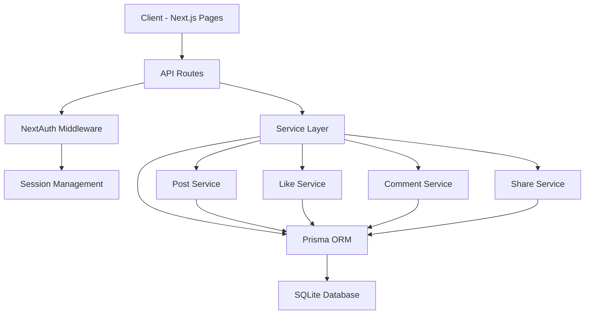

# Design Document: Tính năng Cộng đồng Nhà trọ

## Overview

Tính năng cộng đồng cho phép chủ nhà (Landlord) và người thuê (Tenant) tương tác với nhau thông qua các bài viết. Người dùng có thể tạo bài viết, like, comment và chia sẻ bài viết của người khác. Tính năng này tạo ra một không gian giao tiếp mở, giúp cải thiện mối quan hệ giữa chủ nhà và người thuê, đồng thời tạo cảm giác cộng đồng trong hệ sinh thái quản lý nhà trọ.

Hệ thống được xây dựng trên Next.js với TypeScript, sử dụng Prisma ORM để quản lý database và NextAuth.js cho authentication. Thiết kế tập trung vào hiệu suất, khả năng mở rộng và trải nghiệm người dùng tốt.

## Architecture



## Main Algorithm/Workflow

```mermaid
sequenceDiagram
    participant U as User
    participant C as Client
    participant API as API Route
    participant S as Service Layer
    participant DB as Database
    
    U->>C: Tạo bài viết
    C->>API: POST /api/posts
    API->>S: createPost(data)
    S->>DB: Insert Post
    DB-->>S: Post created
    S-->>API: Return post
    API-->>C: 201 Created
    C-->>U: Hiển thị bài viết mới
    
    U->>C: Like bài viết
    C->>API: POST /api/posts/:id/like
    API->>S: toggleLike(postId, userId)
    S->>DB: Insert/Delete Like
    DB-->>S: Like updated
    S-->>API: Return like status
    API-->>C: 200 OK
    C-->>U: Cập nhật UI

## Components and Interfaces

### Component 1: Post Management

**Purpose**: Quản lý việc tạo, đọc, cập nhật và xóa bài viết

**Interface**:
```typescript
interface Post {
  id: string
  authorId: string
  authorType: 'LANDLORD' | 'TENANT'
  content: string
  images?: string[]
  createdAt: Date
  updatedAt: Date
  
  // Relations
  author: User
  likes: Like[]
  comments: Comment[]
  shares: Share[]
  
  // Computed fields
  likeCount: number
  commentCount: number
  shareCount: number
}

interface CreatePostInput {
  content: string
  images?: string[]
}

interface UpdatePostInput {
  content?: string
  images?: string[]
}

interface PostService {
  createPost(authorId: string, data: CreatePostInput): Promise<Post>
  getPost(id: string): Promise<Post | null>
  getPosts(filters: PostFilters): Promise<Post[]>
  updatePost(id: string, data: UpdatePostInput): Promise<Post>
  deletePost(id: string): Promise<void>
}
```

**Responsibilities**:
- Tạo bài viết mới với nội dung và hình ảnh
- Lấy danh sách bài viết với phân trang và lọc
- Cập nhật nội dung bài viết
- Xóa bài viết (chỉ tác giả hoặc admin)
- Validate dữ liệu đầu vào

### Component 2: Like Management

**Purpose**: Quản lý việc like/unlike bài viết

**Interface**:
```typescript
interface Like {
  id: string
  postId: string
  userId: string
  createdAt: Date
  
  // Relations
  post: Post
  user: User
}

interface LikeService {
  toggleLike(postId: string, userId: string): Promise<{ liked: boolean }>
  getLikes(postId: string): Promise<Like[]>
  hasUserLiked(postId: string, userId: string): Promise<boolean>
}
```

**Responsibilities**:
- Toggle like/unlike cho bài viết
- Lấy danh sách người đã like
- Kiểm tra trạng thái like của user
- Đảm bảo mỗi user chỉ like 1 lần

### Component 3: Comment Management

**Purpose**: Quản lý bình luận trên bài viết

**Interface**:
```typescript
interface Comment {
  id: string
  postId: string
  authorId: string
  content: string
  parentId?: string
  createdAt: Date
  updatedAt: Date
  
  // Relations
  post: Post
  author: User
  parent?: Comment
  replies: Comment[]
}

interface CreateCommentInput {
  content: string
  parentId?: string
}

interface CommentService {
  createComment(postId: string, authorId: string, data: CreateCommentInput): Promise<Comment>
  getComments(postId: string): Promise<Comment[]>
  updateComment(id: string, content: string): Promise<Comment>
  deleteComment(id: string): Promise<void>
}
```

**Responsibilities**:
- Tạo bình luận mới
- Hỗ trợ bình luận lồng nhau (replies)
- Cập nhật và xóa bình luận
- Lấy danh sách bình luận theo bài viết

### Component 4: Share Management

**Purpose**: Quản lý việc chia sẻ bài viết

**Interface**:
```typescript
interface Share {
  id: string
  postId: string
  userId: string
  sharedWith?: string
  createdAt: Date
  
  // Relations
  post: Post
  user: User
}

interface ShareService {
  sharePost(postId: string, userId: string, sharedWith?: string): Promise<Share>
  getShares(postId: string): Promise<Share[]>
}
```

**Responsibilities**:
- Ghi nhận việc chia sẻ bài viết
- Theo dõi số lượng chia sẻ
- Hỗ trợ chia sẻ qua các kênh khác nhau

## Data Models

### Model 1: Post

```typescript
model Post {
  id          String   @id @default(cuid())
  authorId    String
  authorType  String   // 'LANDLORD' or 'TENANT'
  content     String
  images      String[] // Array of image URLs
  createdAt   DateTime @default(now())
  updatedAt   DateTime @updatedAt
  
  // Relations
  likes       Like[]
  comments    Comment[]
  shares      Share[]
  
  @@index([authorId])
  @@index([createdAt])
}
```

**Validation Rules**:
- `content` không được rỗng và tối đa 5000 ký tự
- `images` tối đa 10 ảnh
- `authorType` phải là 'LANDLORD' hoặc 'TENANT'
- `authorId` phải tồn tại trong User table

### Model 2: Like

```typescript
model Like {
  id        String   @id @default(cuid())
  postId    String
  userId    String
  createdAt DateTime @default(now())
  
  post      Post     @relation(fields: [postId], references: [id], onDelete: Cascade)
  user      User     @relation(fields: [userId], references: [id], onDelete: Cascade)
  
  @@unique([postId, userId])
  @@index([postId])
  @@index([userId])
}
```

**Validation Rules**:
- Mỗi user chỉ có thể like 1 lần cho mỗi bài viết (unique constraint)
- `postId` và `userId` phải tồn tại

### Model 3: Comment

```typescript
model Comment {
  id        String    @id @default(cuid())
  postId    String
  authorId  String
  content   String
  parentId  String?
  createdAt DateTime  @default(now())
  updatedAt DateTime  @updatedAt
  
  post      Post      @relation(fields: [postId], references: [id], onDelete: Cascade)
  author    User      @relation(fields: [authorId], references: [id], onDelete: Cascade)
  parent    Comment?  @relation("CommentReplies", fields: [parentId], references: [id], onDelete: Cascade)
  replies   Comment[] @relation("CommentReplies")
  
  @@index([postId])
  @@index([authorId])
  @@index([parentId])
}
```

**Validation Rules**:
- `content` không được rỗng và tối đa 1000 ký tự
- `parentId` nếu có phải tồn tại và thuộc cùng `postId`
- Giới hạn độ sâu reply tối đa 3 cấp

### Model 4: Share

```typescript
model Share {
  id         String   @id @default(cuid())
  postId     String
  userId     String
  sharedWith String?  // 'facebook', 'twitter', 'link', etc.
  createdAt  DateTime @default(now())
  
  post       Post     @relation(fields: [postId], references: [id], onDelete: Cascade)
  user       User     @relation(fields: [userId], references: [id], onDelete: Cascade)
  
  @@index([postId])
  @@index([userId])
}
```

**Validation Rules**:
- `postId` và `userId` phải tồn tại
- `sharedWith` nếu có phải là giá trị hợp lệ

## Key Functions with Formal Specifications

### Function 1: createPost()

```typescript
async function createPost(
  authorId: string,
  data: CreatePostInput
): Promise<Post>
```

**Preconditions:**
- `authorId` is non-null and exists in User table
- `data.content` is non-empty string with length ≤ 5000
- `data.images` if provided, is array with length ≤ 10
- User is authenticated and authorized

**Postconditions:**
- Returns valid Post object with generated id
- Post is persisted in database
- `post.authorId === authorId`
- `post.createdAt` and `post.updatedAt` are set to current timestamp
- `post.likeCount === 0`, `post.commentCount === 0`, `post.shareCount === 0`

**Loop Invariants:** N/A

### Function 2: toggleLike()

```typescript
async function toggleLike(
  postId: string,
  userId: string
): Promise<{ liked: boolean }>
```

**Preconditions:**
- `postId` exists in Post table
- `userId` exists in User table
- User is authenticated

**Postconditions:**
- If like existed: Like is deleted, returns `{ liked: false }`
- If like didn't exist: Like is created, returns `{ liked: true }`
- Post's likeCount is updated accordingly
- No duplicate likes exist for same (postId, userId) pair

**Loop Invariants:** N/A

### Function 3: createComment()

```typescript
async function createComment(
  postId: string,
  authorId: string,
  data: CreateCommentInput
): Promise<Comment>
```

**Preconditions:**
- `postId` exists in Post table
- `authorId` exists in User table
- `data.content` is non-empty string with length ≤ 1000
- If `data.parentId` provided, it exists and belongs to same post
- Reply depth ≤ 3 levels

**Postconditions:**
- Returns valid Comment object with generated id
- Comment is persisted in database
- Post's commentCount is incremented
- If reply, parent's replies array includes new comment

**Loop Invariants:** N/A

### Function 4: getPosts()

```typescript
async function getPosts(
  filters: PostFilters
): Promise<Post[]>
```

**Preconditions:**
- `filters.page` ≥ 1
- `filters.limit` is between 1 and 100
- `filters.authorId` if provided, exists in User table

**Postconditions:**
- Returns array of Post objects
- Posts are sorted by createdAt DESC by default
- Array length ≤ filters.limit
- Each post includes computed fields (likeCount, commentCount, shareCount)
- Posts match all provided filters

**Loop Invariants:**
- For pagination loop: All returned posts satisfy filter criteria
- Posts remain sorted by specified order

## Algorithmic Pseudocode

### Main Post Creation Algorithm

```typescript
ALGORITHM createPost(authorId, data)
INPUT: authorId of type string, data of type CreatePostInput
OUTPUT: post of type Post

BEGIN
  // Validate input
  ASSERT authorId !== null AND authorId !== ""
  ASSERT data.content.length > 0 AND data.content.length <= 5000
  ASSERT data.images === undefined OR data.images.length <= 10
  
  // Get author information
  author ← await database.user.findUnique({ where: { id: authorId } })
  ASSERT author !== null
  
  // Determine author type
  IF author.landlord !== null THEN
    authorType ← "LANDLORD"
  ELSE IF author.tenant !== null THEN
    authorType ← "TENANT"
  ELSE
    THROW Error("User must be either landlord or tenant")
  END IF
  
  // Create post
  post ← await database.post.create({
    data: {
      authorId: authorId,
      authorType: authorType,
      content: data.content,
      images: data.images || []
    },
    include: {
      likes: true,
      comments: true,
      shares: true
    }
  })
  
  // Compute counts
  post.likeCount ← post.likes.length
  post.commentCount ← post.comments.length
  post.shareCount ← post.shares.length
  
  ASSERT post.id !== null
  ASSERT post.authorId === authorId
  
  RETURN post
END
```

**Preconditions:**
- authorId is valid and exists in database
- data.content is validated
- User is authenticated

**Postconditions:**
- Post is created and persisted
- All counts are initialized to 0
- Post object is fully populated

### Like Toggle Algorithm

```typescript
ALGORITHM toggleLike(postId, userId)
INPUT: postId of type string, userId of type string
OUTPUT: result of type { liked: boolean }

BEGIN
  // Validate inputs
  ASSERT postId !== null AND postId !== ""
  ASSERT userId !== null AND userId !== ""
  
  // Check if post exists
  post ← await database.post.findUnique({ where: { id: postId } })
  ASSERT post !== null
  
  // Check if like exists
  existingLike ← await database.like.findUnique({
    where: {
      postId_userId: {
        postId: postId,
        userId: userId
      }
    }
  })
  
  IF existingLike !== null THEN
    // Unlike: Delete existing like
    await database.like.delete({
      where: { id: existingLike.id }
    })
    RETURN { liked: false }
  ELSE
    // Like: Create new like
    await database.like.create({
      data: {
        postId: postId,
        userId: userId
      }
    })
    RETURN { liked: true }
  END IF
END
```

**Preconditions:**
- postId and userId are valid
- User is authenticated

**Postconditions:**
- Like state is toggled
- No duplicate likes exist
- Return value reflects current state

### Comment Creation Algorithm

```typescript
ALGORITHM createComment(postId, authorId, data)
INPUT: postId of type string, authorId of type string, data of type CreateCommentInput
OUTPUT: comment of type Comment

BEGIN
  // Validate input
  ASSERT postId !== null AND postId !== ""
  ASSERT authorId !== null AND authorId !== ""
  ASSERT data.content.length > 0 AND data.content.length <= 1000
  
  // Verify post exists
  post ← await database.post.findUnique({ where: { id: postId } })
  ASSERT post !== null
  
  // If reply, validate parent comment
  IF data.parentId !== null THEN
    parentComment ← await database.comment.findUnique({
      where: { id: data.parentId },
      include: { parent: { include: { parent: true } } }
    })
    
    ASSERT parentComment !== null
    ASSERT parentComment.postId === postId
    
    // Check reply depth (max 3 levels)
    depth ← 1
    current ← parentComment
    WHILE current.parent !== null DO
      depth ← depth + 1
      current ← current.parent
      ASSERT depth <= 3
    END WHILE
  END IF
  
  // Create comment
  comment ← await database.comment.create({
    data: {
      postId: postId,
      authorId: authorId,
      content: data.content,
      parentId: data.parentId
    },
    include: {
      author: true,
      replies: true
    }
  })
  
  ASSERT comment.id !== null
  ASSERT comment.postId === postId
  
  RETURN comment
END
```

**Preconditions:**
- All IDs are valid
- Content is validated
- Reply depth constraint is satisfied

**Postconditions:**
- Comment is created and linked to post
- If reply, linked to parent comment
- Reply depth ≤ 3

**Loop Invariants:**
- depth counter accurately reflects nesting level
- All parent references are valid

### Post Retrieval with Pagination Algorithm

```typescript
ALGORITHM getPosts(filters)
INPUT: filters of type PostFilters
OUTPUT: posts of type Post[]

BEGIN
  // Validate pagination parameters
  page ← filters.page || 1
  limit ← filters.limit || 20
  ASSERT page >= 1
  ASSERT limit >= 1 AND limit <= 100
  
  // Calculate skip for pagination
  skip ← (page - 1) * limit
  
  // Build where clause
  where ← {}
  IF filters.authorId !== undefined THEN
    where.authorId ← filters.authorId
  END IF
  IF filters.authorType !== undefined THEN
    where.authorType ← filters.authorType
  END IF
  IF filters.search !== undefined THEN
    where.content ← { contains: filters.search }
  END IF
  
  // Build order by clause
  orderBy ← filters.orderBy || { createdAt: "desc" }
  
  // Fetch posts with relations
  posts ← await database.post.findMany({
    where: where,
    skip: skip,
    take: limit,
    orderBy: orderBy,
    include: {
      author: {
        select: {
          id: true,
          name: true,
          email: true
        }
      },
      likes: true,
      comments: true,
      shares: true
    }
  })
  
  // Compute counts for each post
  FOR each post IN posts DO
    post.likeCount ← post.likes.length
    post.commentCount ← post.comments.length
    post.shareCount ← post.shares.length
    
    // Check if current user liked the post
    IF filters.currentUserId !== undefined THEN
      post.isLikedByCurrentUser ← post.likes.some(
        like => like.userId === filters.currentUserId
      )
    END IF
  END FOR
  
  ASSERT posts.length <= limit
  
  RETURN posts
END
```

**Preconditions:**
- Pagination parameters are valid
- Filter values are properly typed
- Database connection is available

**Postconditions:**
- Returns array of posts matching filters
- Posts are properly sorted
- Each post has computed fields
- Array length ≤ limit

**Loop Invariants:**
- All processed posts have valid computed counts
- Posts maintain sort order
- All posts satisfy filter criteria

## Example Usage

```typescript
// Example 1: Create a new post
const newPost = await createPost(userId, {
  content: "Chào mọi người! Tôi vừa chuyển đến tòa nhà A. Rất vui được làm quen với các bạn.",
  images: ["/uploads/welcome-photo.jpg"]
})

// Example 2: Toggle like on a post
const likeResult = await toggleLike(postId, userId)
if (likeResult.liked) {
  console.log("Đã like bài viết")
} else {
  console.log("Đã bỏ like")
}

// Example 3: Create a comment
const comment = await createComment(postId, userId, {
  content: "Chào bạn! Chúc bạn có trải nghiệm tốt tại đây."
})

// Example 4: Reply to a comment
const reply = await createComment(postId, userId, {
  content: "Cảm ơn bạn nhiều!",
  parentId: comment.id
})

// Example 5: Get posts with filters
const posts = await getPosts({
  page: 1,
  limit: 20,
  authorType: "LANDLORD",
  orderBy: { createdAt: "desc" },
  currentUserId: userId
})

// Example 6: Share a post
const share = await sharePost(postId, userId, "facebook")

// Example 7: Complete workflow - User creates post and others interact
async function communityWorkflow() {
  // Landlord creates announcement
  const post = await createPost(landlordId, {
    content: "Thông báo: Sẽ bảo trì hệ thống nước vào thứ 7 tuần này."
  })
  
  // Tenants like the post
  await toggleLike(post.id, tenant1Id)
  await toggleLike(post.id, tenant2Id)
  
  // Tenant comments
  const comment = await createComment(post.id, tenant1Id, {
    content: "Cảm ơn thông báo. Khoảng mấy giờ ạ?"
  })
  
  // Landlord replies
  await createComment(post.id, landlordId, {
    content: "Từ 8h sáng đến 12h trưa bạn nhé.",
    parentId: comment.id
  })
  
  // Get updated post with all interactions
  const updatedPost = await getPost(post.id)
  console.log(`Likes: ${updatedPost.likeCount}`)
  console.log(`Comments: ${updatedPost.commentCount}`)
}
```

## Correctness Properties

*A property is a characteristic or behavior that should hold true across all valid executions of a system-essentially, a formal statement about what the system should do. Properties serve as the bridge between human-readable specifications and machine-verifiable correctness guarantees.*

### Property 1: Post Content Validation

*For any* post creation request with valid content (length between 1 and 5000 characters), the system should accept and create the post with a unique ID.

**Validates: Requirements 1.1, 1.3**

### Property 2: Post Author Recording

*For any* created post, the authorId and authorType should be correctly recorded and match the creating user's information.

**Validates: Requirements 1.2, 7.1, 7.2**

### Property 3: Post Image Limit

*For any* post creation request with images, if the image array length is at most 10, the system should accept the post.

**Validates: Requirement 1.6**

### Property 4: Post Initialization

*For any* newly created post, the createdAt and updatedAt timestamps should be set to current time, and likeCount, commentCount, shareCount should be initialized to zero.

**Validates: Requirements 1.8, 1.9**

### Property 5: Post Sorting

*For any* post retrieval request without explicit ordering, returned posts should be sorted by createdAt in descending order.

**Validates: Requirement 2.1**

### Property 6: Pagination Limit

*For any* post retrieval request with a limit parameter, the number of returned posts should not exceed the specified limit.

**Validates: Requirement 2.2**

### Property 7: Author Filtering

*For any* post retrieval request filtered by authorId, all returned posts should have that authorId.

**Validates: Requirement 2.5**

### Property 8: Author Type Filtering

*For any* post retrieval request filtered by authorType, all returned posts should have that authorType.

**Validates: Requirement 2.6**

### Property 9: Search Filtering

*For any* post retrieval request with a search term, all returned posts should contain that term in their content.

**Validates: Requirement 2.7**

### Property 10: Computed Fields Presence

*For any* returned post, the response should include computed fields likeCount, commentCount, and shareCount.

**Validates: Requirement 2.8**

### Property 11: Sensitive Data Exclusion

*For any* returned post with author information, sensitive fields like passwords should not be included.

**Validates: Requirements 2.9, 11.8**

### Property 12: Post Update Timestamp

*For any* post update by the owner, the updatedAt timestamp should be updated to reflect the modification time.

**Validates: Requirement 3.1**

### Property 13: Update Authorization

*For any* post update attempt by a user who is not the author, the system should reject the request with an authorization error.

**Validates: Requirements 3.2, 8.5**

### Property 14: Post Deletion

*For any* post deletion by the owner, the post should be removed from the database.

**Validates: Requirement 3.3**

### Property 15: Cascade Deletion of Likes

*For any* deleted post, all associated likes should be automatically deleted.

**Validates: Requirement 3.4**

### Property 16: Cascade Deletion of Comments

*For any* deleted post, all associated comments should be automatically deleted.

**Validates: Requirement 3.5**

### Property 17: Cascade Deletion of Shares

*For any* deleted post, all associated shares should be automatically deleted.

**Validates: Requirement 3.6**

### Property 18: Delete Authorization

*For any* post deletion attempt by a user who is not the author, the system should reject the request with an authorization error.

**Validates: Requirements 3.7, 8.6**

### Property 19: Like Creation

*For any* user liking a post they haven't liked before, a like record should be created.

**Validates: Requirement 4.1**

### Property 20: Like Toggle Idempotence

*For any* post and user, toggling like twice should return to the original state (liked → unliked → liked, or unliked → liked → unliked).

**Validates: Requirement 4.2**

### Property 21: Like Uniqueness

*For any* post-user pair, at most one like record should exist in the database.

**Validates: Requirements 4.3, 7.4**

### Property 22: Like Count Accuracy

*For any* post, the likeCount should equal the actual number of like records for that post.

**Validates: Requirement 4.4**

### Property 23: Like Status Query

*For any* post and user, querying the like status should return whether the user has liked the post.

**Validates: Requirement 4.5**

### Property 24: Like List Completeness

*For any* post, querying likes should return all users who have liked that post.

**Validates: Requirement 4.6**

### Property 25: Comment Creation

*For any* comment creation with valid content, a new comment with unique ID should be created.

**Validates: Requirement 5.1**

### Property 26: Comment Count Increment

*For any* comment creation, the associated post's commentCount should be incremented by one.

**Validates: Requirement 5.4**

### Property 27: Reply Parent Link

*For any* reply to a comment, the created comment should have parentId set to the parent comment's ID.

**Validates: Requirement 5.5**

### Property 28: Reply Post Validation

*For any* reply creation, the parent comment must belong to the same post as the reply.

**Validates: Requirement 5.6**

### Property 29: Comment Depth Limit

*For any* comment in the system, the nesting depth should not exceed 3 levels.

**Validates: Requirement 5.7**

### Property 30: Comment Update Timestamp

*For any* comment update by the owner, the updatedAt timestamp should be updated.

**Validates: Requirement 5.9**

### Property 31: Comment Cascade Deletion

*For any* deleted comment, all its replies should also be deleted.

**Validates: Requirement 5.10**

### Property 32: Comment Nested Structure

*For any* comment retrieval for a post, comments should be returned with proper nested reply structure.

**Validates: Requirement 5.11**

### Property 33: Comment Authorization

*For any* comment update or delete attempt by a user who is not the author, the system should reject with authorization error.

**Validates: Requirements 8.7, 8.8**

### Property 34: Share Creation

*For any* user sharing a post, a share record should be created.

**Validates: Requirement 6.1**

### Property 35: Share Count Increment

*For any* share creation, the post's shareCount should be incremented.

**Validates: Requirement 6.2**

### Property 36: Share Platform Recording

*For any* share with platform information, the sharedWith value should be recorded.

**Validates: Requirement 6.3**

### Property 37: Share List Completeness

*For any* post, querying shares should return all share records for that post.

**Validates: Requirement 6.4**

### Property 38: Referential Integrity - Likes

*For any* like record, both postId and userId must reference existing records in their respective tables.

**Validates: Requirement 7.3**

### Property 39: Referential Integrity - Comments

*For any* comment record, both postId and authorId must reference existing records.

**Validates: Requirement 7.5**

### Property 40: Referential Integrity - Comment Parent

*For any* comment with a parentId, the parent comment must exist in the database.

**Validates: Requirement 7.6**

### Property 41: Referential Integrity - Shares

*For any* share record, both postId and userId must reference existing records.

**Validates: Requirement 7.7**

### Property 42: Timestamp Ordering

*For any* post or comment, createdAt should be less than or equal to updatedAt.

**Validates: Requirement 7.8**

### Property 43: Validation Error Response

*For any* request with invalid input, the system should return a validation error with descriptive message.

**Validates: Requirement 10.1**

### Property 44: Not Found Error Response

*For any* request for a non-existent resource, the system should return a not found error.

**Validates: Requirement 10.4**

### Property 45: Content Sanitization

*For any* user-submitted content, HTML tags should be sanitized and special characters escaped before storage.

**Validates: Requirements 11.1, 11.2**

### Property 46: Image Type Validation

*For any* image upload, the file type must be image/jpeg, image/png, or image/gif.

**Validates: Requirements 11.3, 12.1**

### Property 47: Image Size Validation

*For any* image upload, the file size must not exceed 5MB.

**Validates: Requirements 11.4, 12.2**

### Property 48: Image Filename Uniqueness

*For any* uploaded image, the system should generate a unique filename to prevent conflicts.

**Validates: Requirement 12.3**

### Property 49: Image Cleanup on Post Deletion

*For any* deleted post with images, the associated image files should be cleaned up.

**Validates: Requirement 12.6**

## Error Handling

### Error Scenario 1: Invalid Post Content

**Condition**: User submits post with empty content or content exceeding 5000 characters
**Response**: Return 400 Bad Request with validation error message
**Recovery**: Display error to user, allow them to correct the content

```typescript
if (!content || content.length === 0) {
  throw new ValidationError("Nội dung bài viết không được để trống")
}
if (content.length > 5000) {
  throw new ValidationError("Nội dung bài viết không được vượt quá 5000 ký tự")
}
```

### Error Scenario 2: Unauthorized Access

**Condition**: User attempts to update/delete post they don't own
**Response**: Return 403 Forbidden
**Recovery**: Redirect to post list, show error message

```typescript
const post = await getPost(postId)
if (post.authorId !== currentUserId) {
  throw new UnauthorizedError("Bạn không có quyền chỉnh sửa bài viết này")
}
```

### Error Scenario 3: Post Not Found

**Condition**: User tries to interact with non-existent post
**Response**: Return 404 Not Found
**Recovery**: Redirect to community feed, show notification

```typescript
const post = await database.post.findUnique({ where: { id: postId } })
if (!post) {
  throw new NotFoundError("Bài viết không tồn tại hoặc đã bị xóa")
}
```

### Error Scenario 4: Comment Depth Exceeded

**Condition**: User tries to reply to a comment at maximum depth (3 levels)
**Response**: Return 400 Bad Request
**Recovery**: Disable reply button for deeply nested comments

```typescript
const depth = await calculateCommentDepth(parentId)
if (depth >= 3) {
  throw new ValidationError("Không thể trả lời comment này. Đã đạt giới hạn độ sâu.")
}
```

### Error Scenario 5: Duplicate Like

**Condition**: Database constraint violation when user tries to like twice
**Response**: Handle gracefully, return current like state
**Recovery**: Update UI to reflect actual state

```typescript
try {
  await database.like.create({ data: { postId, userId } })
  return { liked: true }
} catch (error) {
  if (error.code === 'P2002') { // Unique constraint violation
    // Already liked, return current state
    return { liked: true }
  }
  throw error
}
```

### Error Scenario 6: Image Upload Failure

**Condition**: Image upload fails due to size, format, or network issues
**Response**: Return 400 Bad Request with specific error
**Recovery**: Allow user to retry or post without images

```typescript
if (image.size > 5 * 1024 * 1024) { // 5MB limit
  throw new ValidationError("Kích thước ảnh không được vượt quá 5MB")
}
if (!['image/jpeg', 'image/png', 'image/gif'].includes(image.type)) {
  throw new ValidationError("Chỉ chấp nhận định dạng JPG, PNG, GIF")
}
```

### Error Scenario 7: Database Connection Failure

**Condition**: Database is unavailable or connection timeout
**Response**: Return 503 Service Unavailable
**Recovery**: Retry with exponential backoff, show maintenance message

```typescript
try {
  return await database.post.create(data)
} catch (error) {
  if (error.code === 'P1001') { // Connection error
    throw new ServiceUnavailableError("Hệ thống đang bảo trì. Vui lòng thử lại sau.")
  }
  throw error
}
```

## Testing Strategy

### Unit Testing Approach

**Test Coverage Goals**: Minimum 80% code coverage for service layer

**Key Test Cases**:

1. **Post Service Tests**:
   - Create post with valid data
   - Create post with invalid content (empty, too long)
   - Create post with too many images
   - Update post by owner
   - Update post by non-owner (should fail)
   - Delete post and verify cascade deletion
   - Get posts with various filters
   - Pagination edge cases (page 0, negative limit)

2. **Like Service Tests**:
   - Toggle like from unliked to liked
   - Toggle like from liked to unliked
   - Verify unique constraint (no duplicate likes)
   - Get like count accuracy
   - Check if user has liked post

3. **Comment Service Tests**:
   - Create top-level comment
   - Create reply to comment
   - Create nested replies up to depth 3
   - Attempt to exceed max depth (should fail)
   - Update comment by owner
   - Delete comment and verify replies are deleted
   - Get comments with nested structure

4. **Share Service Tests**:
   - Share post to different platforms
   - Track share count
   - Verify share is recorded with correct metadata

**Testing Framework**: Jest with TypeScript

```typescript
describe('PostService', () => {
  describe('createPost', () => {
    it('should create post with valid data', async () => {
      const post = await postService.createPost(userId, {
        content: 'Test post',
        images: []
      })
      expect(post.id).toBeDefined()
      expect(post.content).toBe('Test post')
      expect(post.authorId).toBe(userId)
    })
    
    it('should throw error for empty content', async () => {
      await expect(
        postService.createPost(userId, { content: '' })
      ).rejects.toThrow('Nội dung bài viết không được để trống')
    })
  })
})
```

### Property-Based Testing Approach

**Property Test Library**: fast-check (already in project dependencies)

**Properties to Test**:

1. **Like Idempotency**: Toggling like twice returns to original state
   ```typescript
   fc.assert(
     fc.asyncProperty(fc.string(), fc.string(), async (postId, userId) => {
       const initial = await hasUserLiked(postId, userId)
       await toggleLike(postId, userId)
       await toggleLike(postId, userId)
       const final = await hasUserLiked(postId, userId)
       return initial === final
     })
   )
   ```

2. **Comment Depth Invariant**: No comment exceeds depth 3
   ```typescript
   fc.assert(
     fc.asyncProperty(fc.array(fc.string()), async (commentIds) => {
       for (const id of commentIds) {
         const depth = await calculateCommentDepth(id)
         expect(depth).toBeLessThanOrEqual(3)
       }
     })
   )
   ```

3. **Count Consistency**: Computed counts match actual relation counts
   ```typescript
   fc.assert(
     fc.asyncProperty(fc.string(), async (postId) => {
       const post = await getPost(postId)
       const actualLikes = await database.like.count({ where: { postId } })
       return post.likeCount === actualLikes
     })
   )
   ```

### Integration Testing Approach

**Test Scenarios**:

1. **Complete Post Lifecycle**:
   - Create post → Like → Comment → Share → Delete
   - Verify all related data is properly created and cleaned up

2. **Multi-User Interactions**:
   - Multiple users like same post
   - Multiple users comment on same post
   - Verify no race conditions or data corruption

3. **API Endpoint Tests**:
   - Test all REST endpoints with various inputs
   - Verify authentication and authorization
   - Test error responses

4. **Database Transaction Tests**:
   - Verify atomic operations
   - Test rollback on errors
   - Ensure data consistency

**Testing Tools**: Jest + Supertest for API testing

```typescript
describe('POST /api/posts', () => {
  it('should create post and return 201', async () => {
    const response = await request(app)
      .post('/api/posts')
      .set('Authorization', `Bearer ${token}`)
      .send({
        content: 'Integration test post',
        images: []
      })
    
    expect(response.status).toBe(201)
    expect(response.body.content).toBe('Integration test post')
  })
})
```

## Performance Considerations

### Database Optimization

1. **Indexing Strategy**:
   - Index on `Post.authorId` for filtering by author
   - Index on `Post.createdAt` for sorting by date
   - Composite index on `Like(postId, userId)` for uniqueness and fast lookups
   - Index on `Comment.postId` for fetching comments by post
   - Index on `Comment.parentId` for nested comment queries

2. **Query Optimization**:
   - Use `select` to fetch only needed fields
   - Implement cursor-based pagination for large datasets
   - Use `include` strategically to avoid N+1 queries
   - Batch load related data when possible

3. **Caching Strategy**:
   - Cache post counts (likes, comments, shares) with TTL
   - Cache popular posts in Redis
   - Invalidate cache on write operations
   - Use stale-while-revalidate pattern for better UX

```typescript
// Example: Efficient post fetching with minimal data
const posts = await database.post.findMany({
  select: {
    id: true,
    content: true,
    createdAt: true,
    author: {
      select: {
        id: true,
        name: true
      }
    },
    _count: {
      select: {
        likes: true,
        comments: true,
        shares: true
      }
    }
  }
})
```

### Frontend Optimization

1. **Infinite Scroll**: Load posts incrementally as user scrolls
2. **Optimistic Updates**: Update UI immediately, rollback on error
3. **Image Lazy Loading**: Load images only when visible
4. **Debounce Search**: Delay search queries to reduce API calls
5. **Virtual Scrolling**: Render only visible posts for large lists

### API Rate Limiting

- Implement rate limiting to prevent abuse
- Limit: 100 requests per minute per user
- Separate limits for read (higher) vs write (lower) operations

```typescript
// Rate limiting configuration
const rateLimits = {
  getPosts: { max: 100, window: '1m' },
  createPost: { max: 10, window: '1m' },
  toggleLike: { max: 50, window: '1m' },
  createComment: { max: 30, window: '1m' }
}
```

## Security Considerations

### Authentication & Authorization

1. **Authentication**: All endpoints require valid JWT token from NextAuth
2. **Authorization Rules**:
   - Users can only edit/delete their own posts
   - Users can only edit/delete their own comments
   - All authenticated users can like, comment, share
   - Admin role can moderate any content

### Input Validation & Sanitization

1. **Content Sanitization**:
   - Strip HTML tags to prevent XSS
   - Escape special characters
   - Validate URLs in content
   - Scan for malicious patterns

```typescript
import DOMPurify from 'isomorphic-dompurify'

function sanitizeContent(content: string): string {
  // Remove HTML tags
  const clean = DOMPurify.sanitize(content, { ALLOWED_TAGS: [] })
  // Trim whitespace
  return clean.trim()
}
```

2. **Image Upload Security**:
   - Validate file type and size
   - Scan for malware
   - Store in secure location (S3, Cloudinary)
   - Generate unique filenames to prevent overwriting
   - Implement Content Security Policy (CSP)

### SQL Injection Prevention

- Use Prisma ORM parameterized queries (built-in protection)
- Never concatenate user input into queries
- Validate all input types

### Rate Limiting & DDoS Protection

- Implement rate limiting per user and per IP
- Use CAPTCHA for suspicious activity
- Monitor for unusual patterns
- Implement exponential backoff for failed requests

### Data Privacy

1. **Personal Information**:
   - Don't expose sensitive user data in API responses
   - Use `select` to exclude password hashes
   - Implement proper GDPR compliance

2. **Content Moderation**:
   - Flag inappropriate content
   - Implement reporting system
   - Admin dashboard for moderation
   - Automated content filtering

```typescript
// Example: Safe user data exposure
const author = await database.user.findUnique({
  where: { id: authorId },
  select: {
    id: true,
    name: true,
    email: true,
    // Exclude: password, sensitive fields
  }
})
```

### CSRF Protection

- Use NextAuth built-in CSRF protection
- Validate CSRF tokens on all state-changing operations
- Use SameSite cookies

## Dependencies

### Core Dependencies (Already in Project)

1. **Next.js** (^15.1.6): React framework for SSR and API routes
2. **TypeScript** (^5): Type safety
3. **Prisma** (^6.2.1): ORM for database operations
4. **NextAuth.js** (^4.24.11): Authentication
5. **React** (^19.0.0): UI library
6. **Zod** (^3.24.1): Schema validation

### Additional Dependencies Needed

1. **Image Upload**:
   - `@uploadthing/react` or `cloudinary`: Image hosting
   - `sharp`: Image processing and optimization

2. **Rich Text** (Optional):
   - `@tiptap/react`: Rich text editor
   - `@tiptap/starter-kit`: Basic editor features

3. **Caching** (Optional for scale):
   - `ioredis`: Redis client for caching
   - `@upstash/redis`: Serverless Redis

4. **Content Sanitization**:
   - `isomorphic-dompurify`: XSS prevention
   - `validator`: Input validation utilities

5. **Rate Limiting**:
   - `@upstash/ratelimit`: Serverless rate limiting
   - Or use Next.js middleware with in-memory store

### Development Dependencies

1. **Testing** (Already in Project):
   - `jest`: Testing framework
   - `@testing-library/react`: React component testing
   - `fast-check`: Property-based testing

2. **Code Quality**:
   - `eslint`: Linting (already in project)
   - `prettier`: Code formatting

### External Services

1. **Image Storage**: Cloudinary, AWS S3, or UploadThing
2. **CDN**: Cloudflare or Vercel Edge Network
3. **Monitoring**: Sentry for error tracking (optional)
4. **Analytics**: Vercel Analytics or Google Analytics (optional)

## Implementation Phases

### Phase 1: Core Features (MVP)
- Database schema and migrations
- Post CRUD operations
- Like functionality
- Basic comment system
- API routes and services

### Phase 2: Enhanced Features
- Nested comments (replies)
- Share functionality
- Image upload
- Pagination and filtering
- Search functionality

### Phase 3: Optimization & Polish
- Caching layer
- Performance optimization
- Rate limiting
- Content moderation
- Admin dashboard

### Phase 4: Advanced Features (Future)
- Real-time updates (WebSocket)
- Notifications for interactions
- Hashtags and mentions
- Post reactions (beyond like)
- Content recommendations
