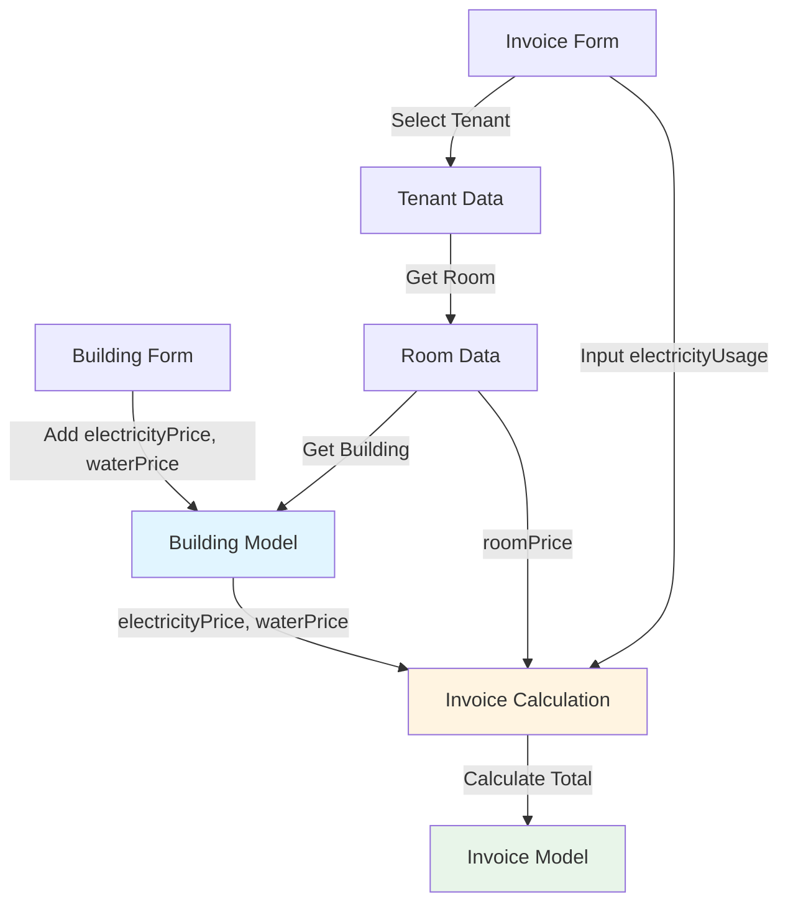
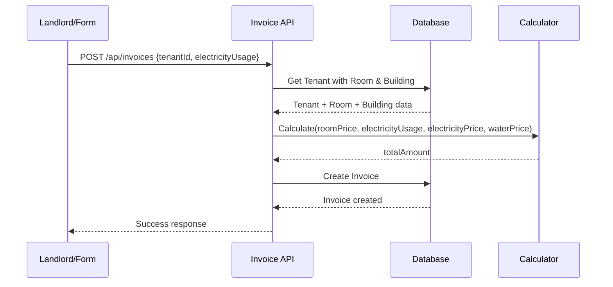

# Design Document: Quản Lý Hóa Đơn Tự Động

## Overview

Tính năng này tự động hóa việc tính toán hóa đơn cho người thuê trọ bằng cách lưu trữ giá điện và giá nước ở cấp độ tòa nhà. Khi tạo hóa đơn, chủ trọ chỉ cần chọn người thuê và nhập số điện tiêu thụ (kWh), hệ thống sẽ tự động tính toán tổng tiền dựa trên: tiền phòng (từ Room), giá điện × số điện (từ Building), và giá nước cố định (từ Building). Điều này giảm thiểu sai sót nhập liệu và đảm bảo tính nhất quán trong việc tính toán hóa đơn.

## Architecture



## Main Algorithm/Workflow



## Components and Interfaces

### Component 1: Building Model (Extended)

**Purpose**: Lưu trữ thông tin giá điện và nước cho mỗi tòa nhà

**Interface**:
```typescript
interface Building {
  id: string
  landlordId: string
  name: string
  address: string
  description?: string
  electricityPrice: number  // VNĐ/kWh (NEW)
  waterPrice: number        // VNĐ/tháng (NEW)
  rooms: Room[]
  createdAt: Date
  updatedAt: Date
}
```

**Responsibilities**:
- Lưu trữ giá điện theo đơn vị kWh
- Lưu trữ giá nước cố định hàng tháng
- Cung cấp giá cho việc tính toán hóa đơn

**Validation Rules**:
- `electricityPrice` >= 0, thường trong khoảng 2000-5000 VNĐ/kWh
- `waterPrice` >= 0, thường trong khoảng 20000-100000 VNĐ/tháng

### Component 2: Invoice Model (Modified)

**Purpose**: Lưu trữ thông tin hóa đơn với chi tiết tính toán

**Interface**:
```typescript
interface Invoice {
  id: string
  tenantId: string
  month: number
  year: number
  rentAmount: number           // Từ Room.price
  electricityUsage: number     // kWh (NEW)
  electricityAmount: number    // electricityUsage × Building.electricityPrice
  waterAmount: number          // Building.waterPrice (cố định)
  serviceAmount: number        // Optional
  otherAmount: number          // Optional
  totalAmount: number          // Tổng tự động
  description?: string
  dueDate?: Date
  paidDate?: Date
  status: string               // UNPAID, PAID, OVERDUE
  tenant: Tenant
  createdAt: Date
  updatedAt: Date
}
```

**Responsibilities**:
- Lưu trữ số điện tiêu thụ (kWh)
- Tự động tính toán các khoản phí
- Đảm bảo tính toàn vẹn dữ liệu

**Validation Rules**:
- `electricityUsage` >= 0, thường < 1000 kWh/tháng
- `totalAmount` = `rentAmount` + `electricityAmount` + `waterAmount` + `serviceAmount` + `otherAmount`
- Unique constraint: (tenantId, month, year)

### Component 3: Building Form (Extended)

**Purpose**: Form tạo/sửa tòa nhà với trường giá điện/nước

**Interface**:
```typescript
interface BuildingFormData {
  name: string
  address: string
  description?: string
  electricityPrice: number  // NEW
  waterPrice: number        // NEW
}
```

**Responsibilities**:
- Thu thập thông tin tòa nhà
- Validate giá điện/nước
- Submit dữ liệu đến API

### Component 4: Invoice Form (Simplified)

**Purpose**: Form tạo hóa đơn đơn giản chỉ cần chọn tenant và nhập số điện

**Interface**:
```typescript
interface InvoiceFormData {
  tenantId: string
  month: number
  year: number
  electricityUsage: number  // kWh (NEW - thay thế electricityPrice)
  serviceAmount?: number    // Optional
  otherAmount?: number      // Optional
}
```

**Responsibilities**:
- Chọn người thuê
- Nhập số điện tiêu thụ (kWh)
- Hiển thị preview tính toán tự động
- Submit dữ liệu đến API

### Component 5: Invoice Calculator Service

**Purpose**: Service tính toán hóa đơn tự động

**Interface**:
```typescript
interface InvoiceCalculator {
  calculateInvoice(params: {
    roomPrice: number
    electricityUsage: number
    electricityPrice: number
    waterPrice: number
    serviceAmount?: number
    otherAmount?: number
  }): InvoiceCalculation
}

interface InvoiceCalculation {
  rentAmount: number
  electricityAmount: number
  waterAmount: number
  serviceAmount: number
  otherAmount: number
  totalAmount: number
}
```

**Responsibilities**:
- Tính toán tiền điện: `electricityUsage × electricityPrice`
- Tính toán tổng tiền
- Đảm bảo tính chính xác

## Data Models

### Building Schema (Extended)

```typescript
model Building {
  id               String   @id @default(cuid())
  landlordId       String
  name             String
  address          String
  description      String?
  electricityPrice Float    @default(3000)  // VNĐ/kWh
  waterPrice       Float    @default(50000) // VNĐ/tháng
  landlord         Landlord @relation(fields: [landlordId], references: [id], onDelete: Cascade)
  rooms            Room[]
  createdAt        DateTime @default(now())
  updatedAt        DateTime @updatedAt
  
  @@index([landlordId])
}
```

**Validation Rules**:
- `electricityPrice` >= 0
- `waterPrice` >= 0
- Default values: electricityPrice = 3000, waterPrice = 50000

### Invoice Schema (Modified)

```typescript
model Invoice {
  id                String   @id @default(cuid())
  tenantId          String
  month             Int
  year              Int
  rentAmount        Float
  electricityUsage  Float    @default(0)  // kWh (NEW)
  electricityAmount Float    @default(0)
  waterAmount       Float    @default(0)
  serviceAmount     Float    @default(0)
  otherAmount       Float    @default(0)
  totalAmount       Float
  description       String?
  dueDate           DateTime?
  paidDate          DateTime?
  status            String   @default("UNPAID")
  tenant            Tenant   @relation(fields: [tenantId], references: [id])
  createdAt         DateTime @default(now())
  updatedAt         DateTime @updatedAt
  
  @@unique([tenantId, month, year])
  @@index([tenantId])
  @@index([status])
}
```

**Validation Rules**:
- `electricityUsage` >= 0
- `month` between 1 and 12
- `year` between 2020 and 2100
- Unique: (tenantId, month, year)

## Key Functions with Formal Specifications

### Function 1: calculateInvoiceAmount()

```typescript
function calculateInvoiceAmount(params: {
  roomPrice: number
  electricityUsage: number
  electricityPrice: number
  waterPrice: number
  serviceAmount?: number
  otherAmount?: number
}): InvoiceCalculation
```

**Preconditions:**
- `roomPrice` >= 0
- `electricityUsage` >= 0
- `electricityPrice` >= 0
- `waterPrice` >= 0
- `serviceAmount` >= 0 (if provided)
- `otherAmount` >= 0 (if provided)

**Postconditions:**
- Returns valid InvoiceCalculation object
- `electricityAmount` = `electricityUsage` × `electricityPrice`
- `waterAmount` = `waterPrice`
- `totalAmount` = sum of all amounts
- All amounts are non-negative numbers

**Loop Invariants:** N/A (no loops)

### Function 2: createInvoiceWithAutoCalculation()

```typescript
async function createInvoiceWithAutoCalculation(data: {
  tenantId: string
  month: number
  year: number
  electricityUsage: number
  serviceAmount?: number
  otherAmount?: number
}): Promise<Invoice>
```

**Preconditions:**
- `tenantId` exists in database
- Tenant has assigned room
- Room belongs to a building
- Building has electricityPrice and waterPrice set
- No existing invoice for (tenantId, month, year)
- `month` between 1 and 12
- `year` between 2020 and 2100
- `electricityUsage` >= 0

**Postconditions:**
- Invoice created in database
- `rentAmount` = tenant's room price
- `electricityAmount` = `electricityUsage` × building's electricityPrice
- `waterAmount` = building's waterPrice
- `totalAmount` correctly calculated
- Invoice status = "UNPAID"
- Returns created invoice with all relations

**Loop Invariants:** N/A

### Function 3: validateBuildingPrices()

```typescript
function validateBuildingPrices(data: {
  electricityPrice: number
  waterPrice: number
}): boolean
```

**Preconditions:**
- `electricityPrice` is a number
- `waterPrice` is a number

**Postconditions:**
- Returns `true` if both prices are >= 0
- Returns `false` otherwise
- No side effects

**Loop Invariants:** N/A

## Algorithmic Pseudocode

### Main Invoice Creation Algorithm

```typescript
ALGORITHM createInvoiceWithAutoCalculation(data)
INPUT: data of type InvoiceCreationRequest
OUTPUT: invoice of type Invoice

BEGIN
  // Step 1: Validate input
  ASSERT data.tenantId IS NOT NULL
  ASSERT data.month >= 1 AND data.month <= 12
  ASSERT data.year >= 2020 AND data.year <= 2100
  ASSERT data.electricityUsage >= 0
  
  // Step 2: Fetch tenant with room and building
  tenant ← database.findTenant({
    id: data.tenantId,
    include: {
      room: {
        include: { building: true }
      }
    }
  })
  
  ASSERT tenant IS NOT NULL
  ASSERT tenant.room IS NOT NULL
  ASSERT tenant.room.building IS NOT NULL
  
  // Step 3: Check for duplicate invoice
  existingInvoice ← database.findInvoice({
    tenantId: data.tenantId,
    month: data.month,
    year: data.year
  })
  
  ASSERT existingInvoice IS NULL
  
  // Step 4: Calculate amounts
  rentAmount ← tenant.room.price
  electricityAmount ← data.electricityUsage × tenant.room.building.electricityPrice
  waterAmount ← tenant.room.building.waterPrice
  serviceAmount ← data.serviceAmount OR 0
  otherAmount ← data.otherAmount OR 0
  
  totalAmount ← rentAmount + electricityAmount + waterAmount + serviceAmount + otherAmount
  
  ASSERT totalAmount >= 0
  
  // Step 5: Create invoice
  invoice ← database.createInvoice({
    tenantId: data.tenantId,
    month: data.month,
    year: data.year,
    rentAmount: rentAmount,
    electricityUsage: data.electricityUsage,
    electricityAmount: electricityAmount,
    waterAmount: waterAmount,
    serviceAmount: serviceAmount,
    otherAmount: otherAmount,
    totalAmount: totalAmount,
    status: "UNPAID"
  })
  
  ASSERT invoice IS NOT NULL
  ASSERT invoice.totalAmount = totalAmount
  
  RETURN invoice
END
```

**Preconditions:**
- Database connection is available
- Input data is validated
- Tenant exists and has room assigned
- No duplicate invoice exists

**Postconditions:**
- Invoice is created in database
- All amounts are correctly calculated
- Invoice status is "UNPAID"
- Returns complete invoice object

**Loop Invariants:** N/A (no loops in main algorithm)

### Building Form Validation Algorithm

```typescript
ALGORITHM validateBuildingForm(formData)
INPUT: formData of type BuildingFormData
OUTPUT: isValid of type boolean, errors of type ValidationErrors

BEGIN
  errors ← empty object
  
  // Validate name
  IF formData.name IS EMPTY THEN
    errors.name ← "Tên tòa nhà là bắt buộc"
  END IF
  
  IF length(formData.name) > 100 THEN
    errors.name ← "Tên tòa nhà quá dài"
  END IF
  
  // Validate address
  IF formData.address IS EMPTY THEN
    errors.address ← "Địa chỉ là bắt buộc"
  END IF
  
  // Validate electricity price
  IF formData.electricityPrice < 0 THEN
    errors.electricityPrice ← "Giá điện phải >= 0"
  END IF
  
  IF formData.electricityPrice > 10000 THEN
    errors.electricityPrice ← "Giá điện quá cao (>10000 VNĐ/kWh)"
  END IF
  
  // Validate water price
  IF formData.waterPrice < 0 THEN
    errors.waterPrice ← "Giá nước phải >= 0"
  END IF
  
  IF formData.waterPrice > 200000 THEN
    errors.waterPrice ← "Giá nước quá cao (>200000 VNĐ/tháng)"
  END IF
  
  isValid ← (errors IS EMPTY)
  
  RETURN (isValid, errors)
END
```

**Preconditions:**
- formData is provided and is an object
- All required fields exist in formData

**Postconditions:**
- Returns boolean indicating validity
- Returns errors object with validation messages
- No side effects on input data

**Loop Invariants:** N/A

## Example Usage

### Example 1: Creating a Building with Utility Prices

```typescript
// Landlord creates a new building
const buildingData = {
  name: "Nhà Trọ Sinh Viên A",
  address: "123 Đường Đại Học, Quận Thủ Đức",
  description: "Gần trường ĐH Bách Khoa",
  electricityPrice: 3500,  // 3500 VNĐ/kWh
  waterPrice: 50000        // 50000 VNĐ/tháng
}

const building = await createBuilding(buildingData)
// Result: Building created with utility prices
```

### Example 2: Creating an Invoice with Auto-Calculation

```typescript
// Landlord creates invoice for tenant
const invoiceData = {
  tenantId: "tenant_123",
  month: 11,
  year: 2024,
  electricityUsage: 150,  // 150 kWh used this month
  serviceAmount: 0,
  otherAmount: 0
}

// System automatically fetches:
// - Room price: 2,500,000 VNĐ
// - Building electricity price: 3,500 VNĐ/kWh
// - Building water price: 50,000 VNĐ/tháng

// Calculation:
// rentAmount = 2,500,000
// electricityAmount = 150 × 3,500 = 525,000
// waterAmount = 50,000
// totalAmount = 2,500,000 + 525,000 + 50,000 = 3,075,000

const invoice = await createInvoiceWithAutoCalculation(invoiceData)
console.log(invoice.totalAmount) // 3,075,000 VNĐ
```

### Example 3: Invoice Form Preview

```typescript
// In the invoice form component
const selectedTenant = tenants.find(t => t.id === formData.tenantId)
const electricityUsage = formData.electricityUsage || 0

if (selectedTenant?.room?.building) {
  const preview = {
    roomPrice: selectedTenant.room.price,
    electricityAmount: electricityUsage × selectedTenant.room.building.electricityPrice,
    waterAmount: selectedTenant.room.building.waterPrice,
    total: selectedTenant.room.price + 
           (electricityUsage × selectedTenant.room.building.electricityPrice) +
           selectedTenant.room.building.waterPrice
  }
  
  // Display preview to user before submission
  displayPreview(preview)
}
```

## Correctness Properties

*A property is a characteristic or behavior that should hold true across all valid executions of a system-essentially, a formal statement about what the system should do. Properties serve as the bridge between human-readable specifications and machine-verifiable correctness guarantees.*

### Property 1: Invoice Total Calculation Correctness

*For any* invoice, the totalAmount should equal the sum of rentAmount, electricityAmount, waterAmount, serviceAmount, and otherAmount.

**Validates: Requirements 2.7, 6.1**

### Property 2: Electricity Amount Calculation

*For any* invoice, the electricityAmount should equal electricityUsage multiplied by the building's electricityPrice.

**Validates: Requirements 2.5, 6.2**

### Property 3: Water Amount Assignment

*For any* invoice, the waterAmount should equal the building's waterPrice.

**Validates: Requirements 2.6, 6.3**

### Property 4: Non-Negative Amounts

*For any* invoice, all amount fields (rentAmount, electricityAmount, waterAmount, totalAmount) should be non-negative.

**Validates: Requirements 4.5, 6.4**

### Property 5: Invoice Uniqueness

*For any* two invoices with the same tenantId, month, and year, they must be the same invoice (same id).

**Validates: Requirements 3.1, 3.3**

### Property 6: Tenant Must Have Room

*For any* invoice creation attempt, the tenant must have an assigned room, otherwise the system should reject the creation.

**Validates: Requirement 2.3**

### Property 7: Building Prices Non-Negative

*For any* building, both electricityPrice and waterPrice must be non-negative.

**Validates: Requirements 1.2, 1.3**

### Property 8: Building Price Persistence Round-Trip

*For any* building with electricityPrice and waterPrice, storing then retrieving the building should return the same price values.

**Validates: Requirement 1.8**

### Property 9: ElectricityUsage Persistence Round-Trip

*For any* invoice with electricityUsage, storing then retrieving the invoice should return the same electricityUsage value.

**Validates: Requirements 2.8, 9.1**

### Property 10: Input Validation Boundaries

*For any* invoice creation with electricityUsage < 0, or month outside 1-12, or year outside 2020-2100, the system should reject the input with validation error.

**Validates: Requirements 4.1, 4.3, 4.4**

### Property 11: Building Price Update Isolation

*For any* existing invoice, when the building's electricityPrice or waterPrice is updated, the invoice amounts should remain unchanged.

**Validates: Requirement 7.4**

### Property 12: Authorization Enforcement

*For any* invoice creation attempt, the system should verify that the tenant belongs to the landlord and the landlord owns the building, rejecting unauthorized access.

**Validates: Requirements 8.1, 8.2**

### Property 13: Rent Amount Assignment

*For any* invoice, the rentAmount should equal the tenant's room price.

**Validates: Requirement 2.4**

### Property 14: Initial Invoice Status

*For any* newly created invoice, the status should be set to "UNPAID".

**Validates: Requirement 2.9**

### Property 15: UI Calculation Reactivity

*For any* change in electricityUsage or other amount fields in the invoice form, the displayed totalAmount should immediately reflect the recalculated value.

**Validates: Requirements 5.2, 5.4**

## Error Handling

### Error Scenario 1: Tenant Has No Room

**Condition**: Attempting to create invoice for tenant without assigned room
**Response**: Return 400 Bad Request with error message "Người thuê chưa được gán phòng"
**Recovery**: User must assign room to tenant before creating invoice

### Error Scenario 2: Duplicate Invoice

**Condition**: Invoice already exists for (tenantId, month, year)
**Response**: Return 400 Bad Request with error message "Hóa đơn đã tồn tại cho tháng này"
**Recovery**: User can view/edit existing invoice or choose different month

### Error Scenario 3: Invalid Electricity Usage

**Condition**: Electricity usage is negative or unreasonably high (>1000 kWh)
**Response**: Form validation error "Số điện không hợp lệ"
**Recovery**: User corrects the input value

### Error Scenario 4: Building Missing Utility Prices

**Condition**: Building has no electricityPrice or waterPrice set
**Response**: Use default values (electricityPrice: 3000, waterPrice: 50000)
**Recovery**: Suggest landlord to update building prices

### Error Scenario 5: Invalid Month/Year

**Condition**: Month not in 1-12 range or year out of valid range
**Response**: Form validation error with specific message
**Recovery**: User corrects the date input

## Testing Strategy

### Unit Testing Approach

**Test Coverage Goals**: >90% for calculation logic, API routes, and form validation

**Key Test Cases**:
1. Invoice calculation with various electricity usage values
2. Building form validation with valid/invalid prices
3. Invoice form validation with edge cases
4. Error handling for missing room/building
5. Duplicate invoice prevention

**Test Files**:
- `__tests__/unit/invoice-calculator.test.ts`
- `__tests__/unit/building-validation.test.ts`
- `__tests__/api/invoices-auto-calc.test.ts`

### Property-Based Testing Approach

**Property Test Library**: fast-check (for TypeScript/JavaScript)

**Properties to Test**:
1. Total amount always equals sum of components
2. Electricity amount = usage × price (commutative)
3. Non-negative amounts invariant
4. Calculation is deterministic (same inputs → same outputs)

**Example Property Test**:
```typescript
import fc from 'fast-check'

test('invoice total equals sum of all amounts', () => {
  fc.assert(
    fc.property(
      fc.float({ min: 0, max: 10000000 }), // roomPrice
      fc.float({ min: 0, max: 500 }),      // electricityUsage
      fc.float({ min: 0, max: 10000 }),    // electricityPrice
      fc.float({ min: 0, max: 200000 }),   // waterPrice
      (roomPrice, usage, ePrice, wPrice) => {
        const result = calculateInvoiceAmount({
          roomPrice,
          electricityUsage: usage,
          electricityPrice: ePrice,
          waterPrice: wPrice
        })
        
        const expectedTotal = 
          roomPrice + 
          (usage * ePrice) + 
          wPrice
        
        return Math.abs(result.totalAmount - expectedTotal) < 0.01
      }
    )
  )
})
```

### Integration Testing Approach

**Integration Test Scenarios**:
1. End-to-end invoice creation flow
2. Building creation → Room creation → Tenant assignment → Invoice creation
3. API integration with database
4. Form submission with auto-calculation

**Test Database**: Use separate test database with seed data

## Performance Considerations

**Database Query Optimization**:
- Use `include` to fetch tenant, room, and building in single query
- Add indexes on frequently queried fields (tenantId, status, month/year)
- Cache building prices for frequently accessed buildings

**Calculation Performance**:
- All calculations are O(1) arithmetic operations
- No performance concerns for typical usage

**Expected Load**:
- Typical: 100-500 invoices created per month per landlord
- Peak: End of month invoice generation
- Response time target: <500ms for invoice creation

## Security Considerations

**Authorization**:
- Verify landlord owns the building before creating invoice
- Verify tenant belongs to landlord before invoice creation
- Prevent cross-landlord data access

**Input Validation**:
- Validate all numeric inputs are non-negative
- Sanitize string inputs (name, address, description)
- Prevent SQL injection through Prisma ORM

**Data Integrity**:
- Use database transactions for invoice creation
- Enforce unique constraint on (tenantId, month, year)
- Validate tenant has room before invoice creation

**Audit Trail**:
- Log all invoice creation/modification actions
- Track who created/modified invoices
- Store original electricity usage for audit purposes

## Dependencies

**Existing Dependencies**:
- Prisma ORM (database access)
- Next.js 14 (framework)
- TypeScript (type safety)
- React Hook Form (form handling)
- Zod (validation)
- shadcn/ui (UI components)

**New Dependencies**: None required

**Database Migration Required**: Yes
- Add `electricityPrice` and `waterPrice` to Building model
- Add `electricityUsage` to Invoice model
- Set default values for existing buildings

**API Changes**:
- Modify POST `/api/buildings` to accept new fields
- Modify POST `/api/invoices` to accept electricityUsage instead of electricityAmount
- Add calculation logic in invoice creation endpoint
